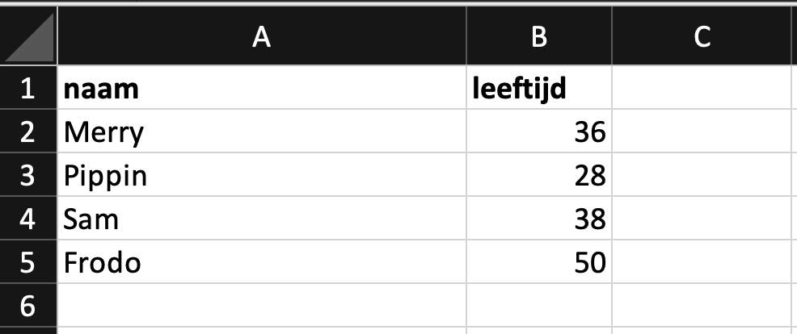

\pagebreak
# Introductie
Je kan hele applicaties bouwen zodra je het programmeren beheerst. Je kan die applicaties zo ingewikkeld en uitgebreid maken als je zelf wilt. Maar hoe sla je daar informatie in op? Als je een applicatie hebt met gebruikers, waar staan die? Hoe voeg je er eentje toe?

Daar gaan we in deze reader dieper op in. Je leert het concept van data (informatie) ophalen en opslaan met code.

Dat begint met MySQL.

## Wat is MySQL?
MySQL is een Relational Database Management System (RDBMS). Het is een database server die je kan draaien op je laptop. Code kan vervolgens praten met die database server om data op te slaan of op te halen. 

Er zijn meer RDBMS dan MySQL, maar we houden het bij MySQL in deze reader. Die RDBMS hebben doorgaans 1 ding gemeen; ze gebruiken allemaal een speciale taal om met databases te praten genaamd SQL (Structured Query Language), alhoewel er helaas teveel verschillende dialecten van bestaan.

Het opslaan van data binnen MySQL gaat via een `storage engine` (of database engine), om te zorgen dat het zo efficient mogelijk opgeslagen wordt. Standaard voor MySQL is dat `InnoDB`, alternatieven zijn b.v. `MyISAM` en `BLACKHOLE`. Die laatste doet exact wat je verwacht - alles wat je opslaat verdwijnt meteen in een zwart gat.

Met MySQL kan je dus een database server op je laptop zetten.

## Wat is een database?
Een database (ook wel schema genoemd) is een overkoepelende plek voor alle data die je wilt opslaan voor een applicatie. Elke applicatie krijgt doorgaans zijn eigen database. 

Dat klinkt heel generiek, maar dat is het ook. Een database (of schema) kan niet zoveel uit zichzelf, het heeft ook maar een paar instellingen waar je aan kan sleutelen.

De belangrijkste instelling in een database is de `character set`; een lijst van de werkelijke karakters die je mag opslaan in de hele database. Denk aan het alphabet, maar ook aanhalingstekens en trëmâ's, en dan heel specifiek een set van mogelijke karakters. Voorbeelden zijn greek, hebrew, UTF8 en UTF16.

Een database doet dus weinig, het is voornamelijk een opslagplek voor tabellen.

## Wat is een tabel?
In een tabel staat je data opgeslagen, en daar kan je het ook weer uithalen. Denk aan een tabel als een Excel sheet; elke tabel heeft rijen en kolommen.

Een tabel is de structuur voor je data, oftewel de kolommen. De rijen die je dan vervolgens toevoegd, dat is de data.

De tabel `gebruikers` kan bijvoorbeeld twee kolommen hebben, `naam` en `leeftijd`. Daar voeg je rijen aan toe, elke rij is dan 1 gebruiker. In Excel is dat dan:

{ width=50% }

Je kan zelf kiezen hoeveel kolommen er in een tabel moeten zitten, en wat voor type ze dan hebben.

## Wat is een kolom?
Elk kolom heeft een data type - net zoals een variabel dat heeft.

Hieronder vind je de meest-gebruikte data types:

| Data type        | Omschrijving                                            |
|------------------|---------------------------------------------------------|
| char(size)       | String van een vaste lengte, niet meer en niet minder.  |
| varchar(size) 	 | String met variabele lengte, tot een maximum lengte van `size`. Dat kan 0 tot 65535 karakters lang zijn. |
| tinytext 	       | String met een maximum lengte van 255 bytes |
| text(size)       | String met een maximum lengte van 65,535 bytes |
| blob(size)       | Blobs (Binary Large OBjects) met maximaal 65,535 bytes |
| longtext 	       | String met een maximum lengte van 4,294,967,295 karakters |
| longblob 	       | Blobs (Binary Large OBjects) met maximaal 4,294,967,295 bytes |
| enum(val1, val2) | Een string gekozen uit een lijst van mogelijke waarden die je aangeeft (val1, val2, etc). Je kan tot 65535 waarden in de ENUM lijst kwijt. |

Daar kan je nu data in zetten via queries.

## Wat is een query?

## Hoe gebruik je het?
MySQL als Relational Database Management System is het overkoepelende wat ervoor zorgt dat het opslaan en ophalen van data werkt. Dat gaat dan via hun eigen dialect van SQL.

Zodra je MySQL hebt geinstalleerd blijft het standaard draaien op je laptop. Het is dan altijd gereed voor het geval jouw code wilt verbinden met een database om data op te slaan of op te halen.

Als je dan ook nog wilt kijken naar welke informatie er allemaal in de database staat, of makkelijk tabellen wilt aanmaken zonder code te hoeven schrijven, dan gebruik je een `database client`. In deze reader gebruiken we `MySQL Workbench`, van de makers van MySQL.

## Waar gebruik je het voor?
Elke applicatie die je maar kan verzinnen gebruikt een database. Zonder het gebruiken of opslaan van data kom je niet heel erg ver. Als je gebruikers wilt laten inloggen, moet je wel ergens gebruikers en hun wachtwoorden hebben staan.

Wil je een webshop bouwen? Dan staan er niet alleen klanten met hun inloggegevens, maar ook bijvoorbeeld producten en bestellingen. Dat kan best ingewikkeld worden, want een bestelling moet wel linken naar een klant én naar 1 of meer producten.

\pagebreak

# 1. Installeren

Installeer MySQL

Installeer MySQL Workbench

Download het SQL bestand van Moodle en open het in MySQL Workbench:

{ width=50% }

Dan krijg je nu alle SQL statements
