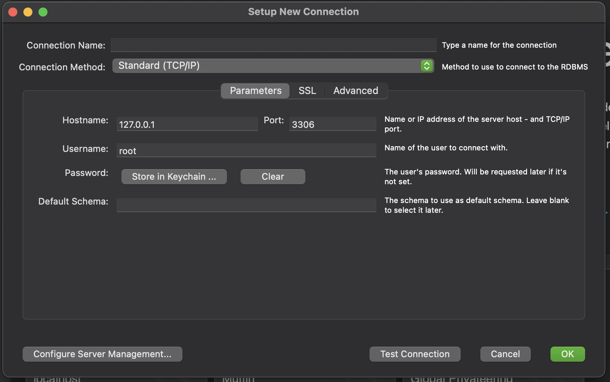
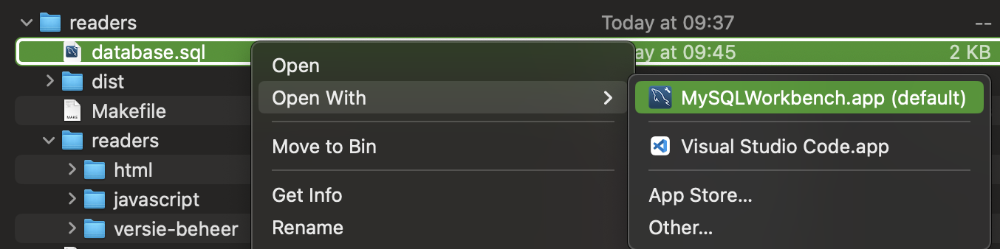

\pagebreak
# Introductie
Je kan hele applicaties bouwen zodra je het programmeren beheerst. Je kan die applicaties zo ingewikkeld en uitgebreid maken als je zelf wilt. Maar hoe sla je daar informatie in op? Als je een applicatie hebt met gebruikers, waar staan die? Hoe voeg je er eentje toe?

Daar gaan we in deze reader dieper op in. Je leert het concept van data (informatie) ophalen en opslaan met code.

Dat begint met MySQL.

## Wat is MySQL?
MySQL is een Relational Database Management System (RDBMS). Het is een database server die je kan draaien op je laptop. Code kan vervolgens praten met die database server om data op te slaan of op te halen. 

Er zijn meer RDBMS dan MySQL, maar we houden het bij MySQL in deze reader. Die RDBMS hebben doorgaans 1 ding gemeen; ze gebruiken allemaal een speciale taal om met databases te praten genaamd SQL (Structured Query Language), alhoewel er helaas teveel verschillende dialecten van bestaan.

Het opslaan van data binnen MySQL gaat via een `storage engine` (of database engine), om te zorgen dat het zo efficient mogelijk opgeslagen wordt. Standaard voor MySQL is dat `InnoDB`, alternatieven zijn b.v. `MyISAM` en `BLACKHOLE`. Die laatste doet exact wat je verwacht - alles wat je opslaat verdwijnt meteen in een zwart gat.

Met MySQL kan je dus een database server op je laptop zetten.

## Wat is een database?
Een database (ook wel schema genoemd) is een overkoepelende plek voor alle data die je wilt opslaan voor een applicatie. Elke applicatie krijgt doorgaans zijn eigen database. 

Dat klinkt heel generiek, maar dat is het ook. Een database (of schema) kan niet zoveel uit zichzelf, het heeft ook maar een paar instellingen waar je aan kan sleutelen.

De belangrijkste instelling in een database is de `character set`; een lijst van de werkelijke karakters die je mag opslaan in de hele database. Denk aan het alphabet, maar ook aanhalingstekens en trëmâ's, en dan heel specifiek een set van mogelijke karakters. Voorbeelden zijn greek, hebrew, UTF8 en UTF16.

Een database doet dus weinig, het is voornamelijk een opslagplek voor tabellen.

## Wat is een tabel?
In een tabel staat je data opgeslagen, en daar kan je het ook weer uithalen. Denk aan een tabel als een Excel sheet; elke tabel heeft rijen en kolommen.

Een tabel is de structuur voor je data, oftewel de kolommen. De rijen die je dan vervolgens toevoegd, dat is de data.

De tabel `gebruikers` kan bijvoorbeeld twee kolommen hebben, `naam` en `leeftijd`. Daar voeg je rijen aan toe, elke rij is dan 1 gebruiker. In Excel is dat dan:

{ width=50% }

Je kan zelf kiezen hoeveel kolommen er in een tabel moeten zitten, en wat voor type ze dan hebben.

## Wat is een kolom?
Elk kolom heeft een data type - net zoals een variabel dat heeft.

Hieronder vind je de meest-gebruikte data types:

| Data type        | Omschrijving                                            |
|------------------|---------------------------------------------------------|
| char(size)       | String van een vaste lengte, niet meer en niet minder.  |
| varchar(size) 	 | String met variabele lengte, tot een maximum lengte van `size`. Dat kan 0 tot 65535 karakters lang zijn. |
| tinytext 	       | String met een maximum lengte van 255 bytes |
| text(size)       | String met een maximum lengte van 65,535 bytes |
| blob(size)       | Blobs (Binary Large OBjects) met maximaal 65,535 bytes |
| longtext 	       | String met een maximum lengte van 4,294,967,295 karakters |
| longblob 	       | Blobs (Binary Large OBjects) met maximaal 4,294,967,295 bytes |
| enum(val1, val2) | Een string gekozen uit een lijst van mogelijke waarden die je aangeeft (val1, val2, etc). Je kan tot 65535 waarden in de ENUM lijst kwijt. |

Daar kan je nu data in zetten via queries.

## Wat is een query?


## Hoe gebruik je het?
MySQL als Relational Database Management System is het overkoepelende wat ervoor zorgt dat het opslaan en ophalen van data werkt. Dat gaat dan via hun eigen dialect van SQL.

Zodra je MySQL hebt geinstalleerd blijft het standaard draaien op je laptop. Het is dan altijd gereed voor het geval jouw code wilt verbinden met een database om data op te slaan of op te halen.

Als je dan ook nog wilt kijken naar welke informatie er allemaal in de database staat, of makkelijk tabellen wilt aanmaken zonder code te hoeven schrijven, dan gebruik je een `database client`. In deze reader gebruiken we `MySQL Workbench`, van de makers van MySQL.

## Waar gebruik je het voor?
Elke applicatie die je maar kan verzinnen gebruikt een database. Zonder het gebruiken of opslaan van data kom je niet heel erg ver. Als je gebruikers wilt laten inloggen, moet je wel ergens gebruikers en hun wachtwoorden hebben staan.

Wil je een webshop bouwen? Dan staan er niet alleen klanten met hun inloggegevens, maar ook bijvoorbeeld producten en bestellingen. Dat kan best ingewikkeld worden, want een bestelling moet wel linken naar een klant én naar 1 of meer producten.

\pagebreak

# 1. Installeren
We hebben nu twee dingen nodig; de database server (MySQL) en de client die we gebruiken om dan te verbinden.

## 1.1 Installeer MySQL
Op de downloads pagina van MySQL kan je de juiste versie vinden voor je laptop:

[https://dev.mysql.com/downloads/installer/](https://dev.mysql.com/downloads/installer/)

De standaard keuze staat meestal goed, het detecteert welk besturingssysteem je gebruikt. Kies vervolgens de onderste download optie, dat is de **community edition**:

{ width=50% }


## 1.2 Installeer MySQL Workbench
Op de downloads pagina van MySQL voor Workbench kan je de juiste versie vinden voor je laptop:

[https://dev.mysql.com/downloads/workbench/](https://dev.mysql.com/downloads/workbench/)

De standaard keuze staat meestal goed, het detecteert welk besturingssysteem je gebruikt:

{ width=50% }


\pagebreak
# 2. Configureren
Nu gaan we de twee verbinden. MySQL draait altijd (als een server). MySQL Workbench is de applicatie waarmee je met MySQL kan praten. We gaan een verbinding aanmaken in MySQL Workbench, met de instellingen zodanig dat het de MySQL gaat vinden die op je laptop draait.

## 2.1 Maak een verbinding aan
Open MySQL Workbench. Het scherm zal eruit zien zoals het screenshot hieronder. Druk op het plusje om een nieuwe verbinding toe te voegen:

{ width=80% }

Dan krijg je een pop-up die eruitziet zoals onderstaande screenshot. Vul de naam in van de verbinding (connection name), je kan invullen wat je wilt. Verder staat alles standaard goed; het wijst naar het adres van je eigen laptop (127.0.0.1), de gebruikersnaam is root en het wachtwoord is standaard leeg (tenzij je een wachtwoord hebt opgegeven).

{ width=80% }

Gebruik de knop "Test connection" om te controleren of alles goed is ingevuld. Zodra alles klopt kan je de verbinding opslaan, druk dus op "OK".

## 2.2 Databases / schemas
Klik op de verbinding die je zojuist hebt aangemaakt, onder het kopje `Connections`. Dit is het scherm wat je ziet:

[](images/workbench-schemas.png){ width=80% }

In MySQL is `schema` een synoniem voor `database`. In de tab `schemas` staan dus de databases (die in MySQL zijn aangemaakt, dus die lijst is leeg).

We gaan een database incl. tabellen importeren, dus nu is het niet van toepassing, maar je kan daar dus een database aanmaken. Je kan daar in dat vlak een rechtermuisklik doen, en dan zie je de optie magisch verschijnen:

{ width=30% }

## 2.4 Maak een Pokédex
Bijna elke applicatie heeft te maken het het opslaan of oproepen van data, denk maar aan de boekenvoorraad van Bol.com, de spelresultaten in een game, etc. Een goed begrip van databases is dan ook heel belangrijk. We gaan daar in dit onderdeel een start mee maken.

We gaan een database bestand importeren. Download het SQL bestand `pokedex.sql`:

[https://github.com/ICT-Academie/readers/blob/main/db-basisbegrippen/pokedex.sql](https://github.com/ICT-Academie/readers/blob/main/db-basisbegrippen/pokedex.sql)

Open het bestand in MySQL Workbench:

{ width=50% }

Dan krijg je nu alle SQL statements ingeladen in MySQL Workbench. Selecteer alles en voer ze allemaal uit. Nu heb je een pokemon database!

\pagebreak

# 3 Select
Het praten met een database (of eerder, de tabellen in een database) gaat altijd via een `query` (ook wel `statement` genoemd). Om data uit de tabellen van een database te krijgen maak je een `select query`. 

## 3.1 Query uitvoeren
Je kan queries typen en uitvoeren vanuit een query venster. De makkelijkste manier om zo'n query venster te openen is met een rechtermuisklik op de tabel. Het maakt niet uit welke tabel omdat je in je query altijd verteld welke tabel je wilt gebruiken.

Vergeet niet de database (of schema) te selecteren door te dubbelklikken. Anders moet je altijd de databasenaam vermelden bij elk tabel.


Dan krijg je een tekstvak te zien, met de resultaten van je query eronder. Met de bliksem icoontjes kan je queries uitvoeren. De linker voert alles uit, dus we gebruiken liever het rechter icoon met de cursor erop. Die voert de query uit waar je cursor nu op staat:


Daarna krijg je eronder de lijst van resultaten te zien. Of een foutmelding.

\pagebreak
## 3.2 Basis query
Zo'n select query ziet er bijvoorbeeld zo uit:

{ width=80% }

Laten we deze query eens ontleden:

`select *`: Een query begint met een werkwoord, in dit geval haal je dus iets op. Na de select staat er wat je precies wilt ophalen. De asterisk (`*`) zegt dat je alles wilt hebben wat er in het tabel staat. Je kan er ook specifieke velden neerzetten.

`from pokemon`: Waar selecteer je iets uit? Of in het geval van iets toevoegen of aanpassen, in welke tabel doe je dat? In dit geval dus de `pokemon` tabel.

Een andere query die je zou kunnen uitvoeren is bijvoorbeeld:

```sql
select * from abilities;
```

Probeer eens een paar tabellen te queryen. Dan gaan we verder naar de volgende stap.

\pagebreak
## 3.3 Select query - where
Voordat we verder gaan met geavanceerdere queries, een belangrijke mededeling: In MySQL zet je alle velden en tabelnamen in backticks (\`). Waarom is dat niet gedaan in het voorbeeld van 3.2? Omdat te laten zien dat het prima werkt zonder. Tot je bijvoorbeeld een beschermd sleutelwoord tegenkomt, en dan gaat het stuk.

Laten we eens specifiek twee velden ophalen van de pokemon:

{ width=80% }

In plaats van de asterisk (*) staan daar dus de velden uit het tabel die je wilt hebben, met komma's gescheiden.

Maar wat nou als we willen zoeken naar alleen enorm zware Pokemon? Dan komt het `where` veld om de hoek kijken:

```sql
select
	`name`,
	`weight` 
from
	`pokemon`
where
	`weight` > 3000;
```

Met `where` kan je bepalen welke `condities` of `vereisten` aan je resultaten hangen. Dus nu willen we alleen Pokemon zien die zwaarder zijn dan 3000 kilo. Dit werkt net zoals een if statement.

Je kan bijvoorbeeld ook zoeken op een specifieke waarde:

```sql
select * from `pokemon` where `weight` = 200
```

Waarbij een string (een stuk tekst) in quotes moet staan, als je daarop zoekt. Net zoals een if statement kan je er ook meerdere vereisten aan hangen, met het sleutelwoord `and` en `or`.

\pagebreak

Bijvoorbeeld:

```sql
select
	`name`,
	`weight` 
from
	`pokemon`
where
	`weight` > 3000
and
	`weight` < 10000
```

In beide gevallen ziet het resultaat er ongeveer zo uit:

| name    | weight |
|---------|-------|
| snorlax |  4600 |
| steelix |  4000 |
| aggron |  3600 |
| wailord |  3980 |
| metagross |  5500 |

Maar dit is niet gesorteerd, dus als je de zwaarste Pokemon wilt vinden is niet heel erg handig.

## 3.4 Select query - order by
Om de resultaten te sorteren komt het sleutelwoord `order by` ook bij het feestje. Dan ziet de query er zo uit:

```sql
select
	`name`,
	`weight` 
from
	`pokemon`
where
	`weight` > 3000
order by
	`weight` desc
```

Achter `order by` zet je de naam van het veld, en daarachter zet je of het oplopend of aflopend gesorteerd moet worden. Ofwel descending (desc) of ascending (asc).

Dan ziet het resultaat er ongeveer zo uit:

| name               | weight |
|--------------------|--------|
| groudon            | 9500   |
| giratina-altered   | 7500   |
| dialga             | 6830   |
| metagross          | 5500   |
| avalugg            | 5050   |

Dat ziet er al veel meer uit als bruikbare data - alle zwaarste Pokemon. Maar nu krijg je een best grote lijst. Misschien kunnen we beter aangeven hoeveel resultaten we willen hebben.

## 3.5 Select query - limit
Met het sleutelwoord `limit` kan je aangeven exact hoeveel resultaten je wilt krijgen. Dan hoeven we in dit geval dus ook geen `where` meer aan te geven - als alles goed gaat krijgen we de top 5 zwaarste Pokemon.

```sql
select
	`name`,
	`weight` 
from
	`pokemon`
order by
	`weight` desc
limit 5
```

Je kan bij een `limit` dus aangeven hoeveel resultaten je wilt hebben. Je kan ook een beginpunt aangeven, voor bijvoorbeeld paginering. De limit van `limit 10, 5` start bijvoorbeeld bij de tiende rij en pakt dan vijf resultaten.

## 3.6 Opdrachten hoofdstuk 3

1. Maak een query die alleen Charmander laat zien. Toon alle velden uit `pokemon`. Je kan Charmander opzoeken adhv zijn naam.
2. Maak een query voor alle Pokémon met een gewicht van 3. Sorteer de lijst op naam.
3. Maak een query voor de top 10 langste pokemon. Toon de naam en lengte.
4. Maak een query voor de allerlichtste pokemon. Toon de naam en basis XP.


\pagebreak

# 4. Join
Nu weet je hoe informatie uit 1 tabel gehaald kan worden. Nu gaan we informatie halen uit meerdere tabellen. Om dat te kunnen doen moeten we aangeven hoe de rijen van data (of records) uit één tabel gekoppeld moet worden aan welke rijen uit een andere tabel. Oftewel een `join`. Er zijn verschillende soorten joins, we leggen ze kort uit maar in deze reader gaan we vooral in op de `left join`.

## 4.1 Soorten joins

### Left join (left outer join)
Hier gaan we straks Pokémon stats mee ophalen. Als startpunt pakken we dan de select query die we hebben gemaakt in hoofdstuk 3. We hebben de top 5 zwaarste Pokémon en we willen graag weten hoeveel HP, attack en defense deze Pokémon hebben. Je ziet alles van de `pokemon` tabel (links) en dan pakken we de `base_stats` tabel erbij (waar er data voor gevonden kan worden). Als er geen `base_stats` rij te vinden is voor een specifieke Pokémon, dan krijg je de rij wel te zien en zijn alle `base_stats` velden `null`. Dat noem je een `left join`.

## Right join (right outer join)
De `right join` is (vreemd genoeg) precies andersom. In het voorbeeld van de Pokémon stats hierboven krijg je alles van `base_stats` (rechts) en dan pakken we de `pokemon` tabel rijen erbij waar een match wordt gevonden. In dit geval is het resultaat in principe hetzelfde omdat elke Pokémon base stats heeft.

## Inner join
Bij de outer joins kies je 1  kant waar je primair alle rijen van terugkrijgt. Bij de `inner join` krijg je alles waar een rij gevonden is aan beide kanten. In ons voorbeeld zie je alles waar zowel een `pokemon` rij én een `base_stats` rij gevonden is.

## Full join
De `full join` toont alles waar een match voor is gevonden in `pokemon` OF `base_stats`. Dus je zou ook base stats terug kunnen krijgen zonder dat er een Pokémon voor gevonden is.


## 4.2 Pokémon stats
We gaan een `left join` inzetten om Pokémon stats op te zoeken. Visueel zien de twee tabellen, `pokemon` en `base_stats` en de relatie ertussen, er zo uit:

{width=70%}

Er komt dus een `join` in de query, maar er verandert nog iets; elk veld moet nu vermelden uit welke tabel het komt.

De nieuwe query ziet er zo uit:

```sql
select
	`pokemon`.`name`,
	`pokemon`.`weight`,
	`base_stats`.`hp`,
	`base_stats`.`attack`,
	`base_stats`.`defense`

from
	`pokemon`

join `base_stats` on
	`base_stats`.`pokemon_id` = `pokemon`.`id`

where
	`pokemon`.`weight` > 3000

order by
	`pokemon`.`weight` desc

limit 5
```

Laten we deze eens ontleden.

1. `select`: Hier staan `name` en `weight` nu met de tabelnaam vermeld. Dus `pokemon`.`weight` pakt het veld `weight` uit de tabel `pokemon`. Daar komen meer velden bij, dus we pakken ook `hp`, `attack` en `defense` uit de tabel `base_stats`.
2. `from`: Hier staat nog steeds de `pokemon` tabel. Vanaf daar kunnen we meer tabellen eraan vast plakken, maar je hebt altijd een startpunt nodig.
3. `join`: Hier kies je meteen het tabel die je erbij pakt (`base_stats`), en de vergelijking waarmee je de verschillende rijen van data aan elkaar wilt koppelen. Dat komt na het sleutelwoord `on`; het veld `pokemon_id` in `base_stats` moet overeenkomen met het veld `id` in `pokemon`. Zo weet je dat de HP, attack en defense werkelijk van de juiste Pokémon zijn.
4. `where`, `order by`: Hier moet ook de tabelnaam vermeld worden, omdat de tabel `base_stats` hier ook gebruikt kan worden.

De join kan zoveel vergelijkingen maken als dat nodig zijn. Net als in `where` kan je `and` en `or` gebruiken. Als we eventjes inzoomen op enkel de `join` kan het er bijvoorbeeld zo uit zien:

```sql
join `base_stats` on
    `base_stats`.`pokemon_id` = `pokemon`.`id`
  and
    `base_stats`.`height` >= 10
  and
    `base_stats`.`height` <= 15
```

Dit zorgt ervoor dat niet alle base_stats erbij worden gezet, alleen degene die aan deze vereisten voldoen. Specifiek een `left join` is dan niet heel handig, omdat je dan de Pokémon wel krijgt maar niet al hun stats.

\pagebreak

## 4.3 Relaties
Voor de tabel `base_stats` is de relatie met de tabel `pokemon` redelijk rechtdoorzee. Het veld `pokemon_id` in `base_stats` is een 1 op 1 koppeling met het veld `id` in de tabel `pokemon`.

Maar relaties zijn niet altijd zo simpel. Je kan de verschillende soorten relaties in drie categorieën zetten:

### One to many
Het zou kunnen zijn dat er meerdere rijen in een tabel zoals `base_stats` te vinden zijn voor een willekeurige `pokemon_id`. Dan heb je een one-to-many relatie, 1 `pokemon` en meerdere `base_stats`.

Dat kan bijvoorbeeld zo zijn met de abilities van een Pokémon. Eén Pokémon kan natuurlijk meerdere abilities hebben. Dit zou prima werken met de query die we hadden geschreven, er komen meer rijen in het resultaat, waarbij de velden uit `pokemon` er meerdere keren zullen staan.

### Many to one
Als je dan een `select` query zou doen vanaf onze fictieve `base_stats` is dat dus andersom. Oftewel een many-to-one relatie, meerdere `base_stats` die linken naar 1 enkele `pokemon`.

Dat kan bijvoorbeeld zo zijn bij bestellingen in een webshop. Meerdere bestellingen kunnen wijzen naar één klant. Dit werkt ook prima met de query die we hebben gemaakt.

### Many to many
Deze relatie is lastiger. Laten we de `abilities` tabel eens als voorbeeld nemen. Meerdere `pokemon` hebben meerdere `abilities`. Dat kan je niet in 1 veld zetten om te koppelen aan elkaar. Je hebt dus een koppeltabel nodig: een tabel specifiek gemaakt met het doel om twee tabellen aan elkaar te koppelen. Elke rij daarin koppelt een Pokémon met een ability.


## 4.4 Opdrachten hoofdstuk 4
Als basis van deze opdrachten kan je de voorbeeld query hierboven pakken en aanpassen.

1. Maak een query met de Pokémon met de allerhoogste HP. Toon de naam en HP.
2. Maak een query met de top 10 snelste Pokémon. Toon hun lengte en gewicht. De snelheid staat in de tabel `base_stats`.

\pagebreak

# 5 Insert & update
Nu weet je redelijk hoe je data kan ophalen uit tabellen, maar je kan ook data toevoegen (insert) en aanpassen (update). We behandelen beide kort.

## 4.1 Insert
Een `insert` statement voegt een nieuwe rij toe in een tabel. Je geeft aan welke velden je wilt vullen bij het aanmaken, en meteen ook de waarden om ze mee te vullen. Je hoeft alleen de verplichte velden te vermelden, degene die niet leeg mogen zijn.

```sql
insert into `pokemon` (
  `name`, 
  `height`, 
  `weight`, 
  `base_experience`
) values (
  "Nova", 
  3, 
  10, 
  70
);
```

Laten we dit even ontleden:

1. Na de `insert into` staat de tabelnaam vermeld.
2. Daarna volgt een lijst van alle velden waar we een waarde in willen zetten in ronde haakjes.
3. Na de `values` komt een zelfde lijst met alle waarden in dezelfde volgorde als de velden. De naam van de nieuwe Pokémon is dus Nova met een gewicht van 10kg, etc. Net als bij variabelen zijn het strings, integers, etc.

## 4.2 Update
Een `update` statement past een rij aan in de tabel. Ook hier geef je de velden aan die je wilt aanpassen.

```sql
update `pokemon`
set
  `name` = "Super Nova", 
  `weight` = 12
where
  `id` = 723;
```

Laten we dit dan ook even ontleden:

1. Na de `update` staat de tabelnaam vermeld.
2. Na `set` staan alle toewijzingen van de velden met de nieuwe waarden, gescheiden met een komma.
3. De `where` limiteert de update tot alle rijen die hiermee matchen. Wees daar dus voorzichtig mee, met een vervelende typfout kunnen alle Pokémon ineens "Super Nova" heten.

\pagebreak

# 5 Bonus: Join via koppeltabel
Dit bonus hoofdstuk is optioneel. We gaan de abilities van alle Pokémon erbij pakken.

Zoals we hadden besproken in hoofdstuk 3 is de many to many relatie een stuk lastiger. Laten we de `abilities` tabel als voorbeeld erbij pakken. Meerdere `pokemon` hebben meerdere `abilities`. Dat kan je niet in 1 veld zetten om te koppelen aan elkaar. Je hebt dan een koppeltabel nodig: een tabel specifiek gemaakt met het doel om twee tabellen aan elkaar te koppelen. Elke rij daarin koppelt een Pokémon met een ability, en dus kan je oneindig veel Pokémon aan oneindig veel abilities koppelen.

## 5.1 De koppeltabel

In onze Pokédex ziet dat er zo uit:

{width=90%}

Elke rij in de tabel `pokemon_abilities` wijst naar 1 rij in `pokemon` én naar 1 rij in `abilities`. Zo kan je dus veel Pokémon koppelen aan veel abilities. Door die koppeling in een losse, nieuwe tabel te zetten wordt er geen dubbele informatie opgeslagen. Anders heb je bijvoorbeeld de ability "Blaze" 60 keer in je database hebben staan in plaats van 1.

## 5.2 De join
De join wordt dan een stuk ingewikkelder. In plaats van 1 join naar 1 tabel (zoals bij `base_stats`) krijg je nu 2 joins. We joinen eerst `pokemon_abilities` adhv de `pokemon_id` en vervolgens joinen we `abilities` adhv de `ability_id`.

Als we inzoomen op enkel de join, gaat het van dit:

```sql
join `base_stats` on
	`base_stats`.`pokemon_id` = `pokemon`.`id`
```

Naar dit:

```sql
join `pokemon_abilities` on
	`pokemon_abilities`.`pokemon_id` = `pokemon`.`id`

join `abilities` on
	`abilities`.`id` = `pokemon_abilities`.`ability_id`
```

De rijen in de `pokemon_abilities` tabel kunnen worden gekoppeld adhv de `id` in `pokemon` tabel. Zodra dat gedaan is hebben we de velden uit `pokemon_abilities` beschikbaar om mee te werken. Vervolgens kunnen we daar de tweede join mee maken, omdat daar een `ability_id` in staat. Daarmee zoeken we de ability op in de `abilities` tabel, met de `id` die daarin staat.

De hele query ziet er zo uit:

```sql
select
	`pokemon`.`name`,
	`pokemon`.`weight`,
	`abilities`.`name` as `ability`

from
	`pokemon`

join `pokemon_abilities` on
	`pokemon_abilities`.`pokemon_id` = `pokemon`.`id`

join `abilities` on
	`abilities`.`id` = `pokemon_abilities`.`ability_id`

where
	`pokemon`.`weight` > 3000

order by
	`pokemon`.`weight` desc
```

Er is nog 1 verandering te vinden: In de `select` wordt een veld hernoemd met `as` omdat er anders twee keer `name` staat in het resultaat. Dit hernoemd alleen het veld hier bij deze query voor het gemak.

Het resultaat ziet er dan zo uit:

| name             | weight | ability     |
|------------------|--------|-------------|
| groudon          | 9500   | drought     |
| giratina-altered | 7500   | pressure    |
| giratina-altered | 7500   | telepathy   |
| dialga           | 6830   | pressure    |
| dialga           | 6830   | telepathy   |
| metagross        | 5500   | clear-body  |
| metagross        | 5500   | light-metal |
| avalugg          | 5050   | own-tempo   |
| avalugg          | 5050   | ice-body    |
| avalugg          | 5050   | sturdy      |
| snorlax          | 4600   | immunity    |
| snorlax          | 4600   | thick-fat   |
| snorlax          | 4600   | gluttony    |

Zoals je ziet staan de Pokémons er meerdere keren in; 1x voor elke ability die ze hebben. Dat is een direct gevolg van hoe joins werken Je kan eromheen werken met `group` en `concat` maar dat is buiten de scope van deze reader. Dit soort scenarios zjn prima op te lossen bij het programmeren.

De bonus opdracht: Vraag op deze zelfde manier de Pokémon types op; via het koppeltabel `pokemon_types` en de tabel `types`.

\pagebreak

# Eindopdracht

1. Maak een query die de top 10 langste Pokémon laat zien, gesorteerd op lengte (groter naar kleiner).
2. Maak een query waarbij je alle Pokémon vindt die net zo zwaar of zwaarder zijn dan 1500, maar minder zwaar dan 2000. Sorteer op gewicht met de zwaarste Pokémon eerst.
3. Toon Charmander, Squirtle en Bulbasaur in 1 lijst, samen met hun HP, attack en defense (uit `base_stats`). Sorteer op naam.
4. Toon de Pokémon met de allerhoogste HP
