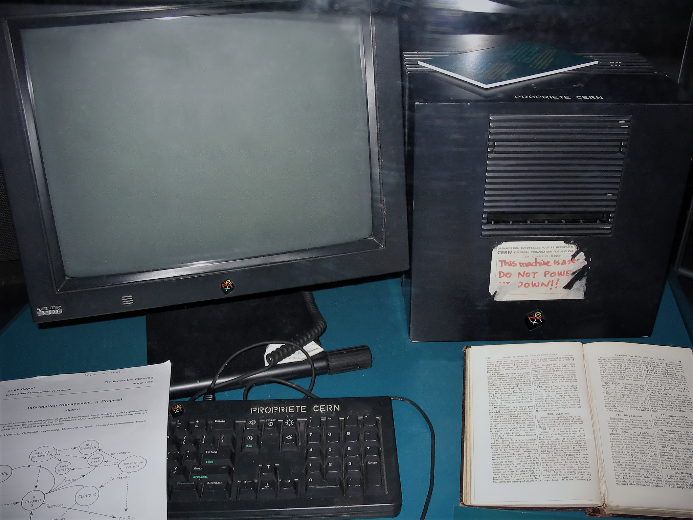

\pagebreak
# HTML
Deze reader is een introductie en behandelt de meest eenvoudige basisbegrippen van HTML en CSS. Zodra je de reader helemaal hebt doorgewerkt, ben je in staat om zelfstandig een eenvoudige website te bouwen.

De reader heeft zeker niet als doel om alles over HTML te behandelen, daarvoor is het gebied veel te uitgebreid. Als je méér wilt weten over HTML of als je bepaalde stof van de reader niet helemaal begrijpt, dan is Google er altijd om je te helpen. Als je er dan nog niet uitkomt staan er natuurlijk docenten voor je klaar.

## Benodigdheden
- Editor (PHPStorm bijvoorbeeld)
- Browser (Firefox of Chrome bijvoorbeeld).
- Google (Begrijp je iets niet? Dit is je beste vriend!)

## Geschiedenis van HTML
HTML staat voor **H**yper**T**ext **M**arkup **L**anguage. Vrij vertaald is een **markup language** een **opmaaktaal**. Het wordt niet gebruikt om je website op te maken (mooi maken), maar het is bedoeld om tekst automatisch te kunnen laten verwerken. Door een browser, bijvoorbeeld.

HTML werd in 1991 bedacht en gebouwd door **Sir Tim Berners-Lee** om wetenschappelijke documenten van het CERN makkelijker te delen. Hij heeft ook de eerste webbrowser gebouwd, die heette **WorldWideWeb**.

{ width=50% }

In 1994 is het World Wide Web Consortium opgericht (W3C), een non-profit organisatie die de nieuwe standaarden voor het web ontwerpt. Inmiddels heeft W3C meer dan 60 werknemers en wordt het gesteund door bedrijven zoals Google en Microsoft. Tim Berners-Lee is de directeur van W3C.

Alle browsers proberen de web standaarden van W3C zo nauw mogelijk te volgen, zodat websites op alle browsers er hetzelfde uit zien. Ongeacht wat de veranderingen en toevoegingen zijn, het doel blijft altijd het zogenoemde **backwards-compatibility**; oftewel zelfs websites gemaakt in 1991 moeten altijd blijven werken.

\pagebreak

# Hoofdstuk 1: Kennis maken met HTML
HTML bestaat uit elementen. Je kan het zien als een blokkendoos. Elke link, afbeelding, paragraaf, etc, is een blok (oftewel een /element/). Vervolgens kan je dat mooi maken met CSS, daar komen we later op terug.

## 1.1 HTML elementen
Een element bestaat uit meerdere onderdelen. Het heeft een begin en een eind, dat noem je `tags`. Tussen de begin- en eind-tag staat jouw content - bijvoorbeeld de tekst die je wilt laten zien. Je kan in de begin-tag extra informatie meegeven. Dat kan je zien als instellingen, met een naam en de werkelijke instelling. Dat noem je een `attribuut`, en daarin geef je een `waarde` mee.

Er zijn in principe twee soorten HTML elementen. Eigenlijk zes, maar we houden het even simpel:

### Normale elementen (normal elements)
Als voorbeeld pakken we een paragraaf (een alinea aan tekst). Dat begint met de tag `<p>`. Tags staan altijd in die chevron tekens (< en >). De tag om te eindigen is dan `</p>`; de slash (/) vertelt dat dit het einde van het element is. Tussen die twee tags staat dus je paragraaf, de werkelijke tekst.

{ width=50% }

De paragraaf ziet er zo uit:

```html
<p>Dit is een paragraaf, en wordt ook zo getoond in de browser.</p>
```

Een link (naar een ander HTML bestand bijvoorbeeld) ziet er zo uit:

```html
<a href="https://google.com">Dit is een link naar Google</a>
```

Die ziet er wel heel raar uit, dus laten we die even ontleden:

- Een link werd vroeger een `anchor` genoemd, daarom heet het element dus `<a>`
- De plek waar je de browser heen wilt wijzen, werd de `hypertext reference` genoemd. Oftewel een `href`. Dat is dus het attribuut waar je je link in zet.
- Een link kan wijzen naar een compleet andere website (b.v. `href="https://google.com/"`) of naar een HTML bestand in dezelfde map (b.v. `href="test.html"`) of zelfs een HTML bestand in een andere map (b.v. `map/nog_een_map/test.html`).
- Tussen de open- en sluitende tag (`<a>` en `</a>`) is er wel degelijk inhoud; de tekst waar je op moet klikken om naar de link te gaan.


\pagebreak

### Lege elementen (void elements)
Sommige elementen, zoals een horizontale lijn op je scherm tekenen of een enter in je tekst (een newline), die hebben geen inhoud nodig. Dat noem je lege elementen, of zelf-sluitende elementen.

Een horizontale streep (Horizontal Rule) typ je bijvoorbeeld zo:

```html
<hr>
```

Een enter (oftewel een BReak) typ je zo:

```html
<br>
```

Een afbeelding (image -> img) typ je zo:

```html

```

Je kan geen afbeelding direct in tekst stoppen. Dus er is geen inhoud in het `` element, maar wél een attribuut om te vertellen welk bestand (welke afbeelding) daar moet komen te staan. Dat is de source, oftewel de bron waar de afbeelding vandaan komt.


## 1.2 Waar zet je HTML elementen neer?
Je kan HTML elementen in andere HTML elementen stoppen (bijvoorbeeld een afbeelding in een paragraaf), of meerdere elementen naast elkaar hebben (bijvoorbeeld een link en een afbeelding onder elkaar). Het zetten van een HTML element in een ander HTML element noem je *nesten*.

Je kan bijvoorbeeld tekst in een paragraaf zetten:

```html
<p>Voorbeeld tekst</p>
```

Maar je kan er ook in zetten. En enters (newlines). We schrijven het iets anders, zodat je duidelijk ziet welke tekst en HTML elementen waar staat:

```html
<p>
    Voorbeeld tekst.
    <br>
    <a href="https://google.com">Ga naar Google</a>
    <br>
    <a href="https://www.w3.org/">Ga naar W3C</a>
</p>
```

Misschien is het eerste wat opvalt dat we heel veel enters, spaties en tabs gebruiken om het overzichtelijker te maken. HTML filtert dat er automatisch uit. Zelfs in een paragraaf zal het alle enters, spaties en tabs vervangen naar 1 spatie.

In de paragraaf staat dus 1 regel tekst, een link naar Google op een nieuwe regel en vervolgens een link naar W3C op nog een nieuwe regel. Zo kan je eigenlijk eindeloos HTML elementen blijven plaatsen in andere HTML elementen. Dat is handig als je bijvoorbeeld een balk bovenin je pagina wilt hebben met een logo én een menu. Dat zijn dan meerdere blokken van HTML elementen die wel bij elkaar staan.

\pagebreak

## 1.3 HTML pagina
Een HTML pagina bestaat uit iets meer dan alleen maar paragrafen en links. Het bestaat uit vier delen:

### Doctype
Een `doctype` is exact wat het zegt: een document type. Het geeft aan wat voor soort document jouw bestand is. Het is niet zomaar een tekst document, het is HTML dus toon het ook als HTML.

Dit is altijd de **eerste regel in een HTML bestand**!

### HTML
Na de doctype is het `html` element altijd het eerste wat je ziet. Daar wordt vervolgens **alle HTML** ingezet. Het is gebruikelijk om daar nog een `lang` attribuut tegen te komen; oftewel de gebruikte taal.

### Head
De `head` is een apart gedeelte van de pagina, met informatie /over/ je pagina. Hier staan zaken die je niet gaat zien op je pagina maar wel heel belangrijk zijn. Denk bijvoorbeeld aan opmaak, een titel in de tab bovenin, etc.

De head zie je niet maar is zeker wel deel van de html. Deze staat in het `html` element, altijd als eerste.

### Body
De `body` is waar de magie gebeurt. Al je HTML en alle tekst komen hierin te staan.

De body staat ook in het `html` element, direct na de `head`.

### Voorbeeld
Als deze vier onderdelen samen komen komt het er zo uit:

```html
<!doctype html>
<html lang="en">
  <head>
    <title>HTML hoofdstuk 1</title>
  </head>
  <body>
    <p>Dit is een paragraaf met een mooi brok tekst.</p>
  </body>
</html>
```

## 1.4 Opdrachten hoofdstuk 1

Maak een nieuw project aan in `PHPStorm`. Maak een bestand `hoofdstuk1a.html` en een bestand `hoofdstuk1b.html`. Zet het bovenstaande voorbeeld erin en maak twee paragrafen in elk bestand, elk met een link naar het andere bestand.

\pagebreak

# Hoofdstuk 2: Tekst en afbeeldingen in HTML
Nu je wat meer weet over hoe HTML is opgebouwd en hoe het werkt, gaan we wat dieper in de stof van tekst en afbeeldingen. Je hebt al een beetje met paragrafen en links gewerkt, maar je kan er nog veel meer mee. Denk bijvoorbeeld aan dikgedrukte tekst, ondersteepte tekst, koppen bij teksten, enzovoorts.

## 2.1 Tekst
Zonder uberhaupt nog CSS aan te raken kan een paragraaf al best goed aangekleed worden.

### Dikgedrukte tekst
Je kan tekst dikgedrukt maken met `<b>` (van bold).

Bijvoorbeeld: `Alleen dit <b>woord</b> is dikgedrukt.`

### Schuingedrukte tekst
Schuin gedrukte tekst maak je met `<i>` (van italic).

Bijvoorbeeld: `Alleen dit <i>woord</i> is schuingedrukt.`

### Ondersteepte tekst
Ondersteepte tekst maak je met `<u>` (van underline).

Bijvoorbeeld: `Alleen dit <u>woord</u> is ondersteept.`

### Kop boven tekst
Een kop zet je boven de paragraaf, en die kop kan je in verschillende groottes neerzetten. Er zijn 6 groottes, en de grootte zit in de naam. `<h1>` (van header) is de grootste kop en `h6` is de kleinste. Bijvoorbeeld:

```html
<h1>Een hele grote kop boven de tekst</h1>
<p>Met een mooie paragraaf eronder.</p>

<h6>Een hele kleine kop boven de tekst</h6>
<p>Met een iets minder mooie paragraaf eronder.</p>
```

## 2.3 Speciale tekens
Speciale karakters kan je laten zien op een webpagina door een bijhorende code in de HTML te zetten. Elk van de speciale karakters begint met een ampersand (`&`) en eindigt met een puntkomma (`;`). Als je deze code in je HTML zet, wordt het automatisch vertaald naar het speciale teken.

Het copyright symbool (`©`) kan je bijvoorbeeld neerzetten als `&copy;`.

Het euro teken (`€`) kan je neerzetten als `&euro;`.

We hebben het eerder gehad over hoe alle spaties, tabs en enters uiteindelijk worden getoond als 1 spatie. Als je toch meerdere spaties wilt tonen, kan je de "no break space" gebruiken: `&nbsp;`. Zoals de naam zegt wordt deze spatie niet opgebroken naar een andere regel en wordt het niet weggecijferd door HTML zelf.

## 2.4 Afbeeldingen
Afbeeldingen kan je overal in de HTML neerzetten, zelfs tussen tekst, en dan staat de afbeelding simpelweg tussen de tekst. Een afbeelding maak je met de `img` tag (image). De `` tag heeft geen inhoud tussen de tags, want daar kan geen afbeelding in gezet worden. De HTML is alleen tekst, dus je zet daar de locatie van de afbeelding - de map en bestandsnaam waar het gevonden kan worden.

Bijvoorbeeld:

```html

```

Als de afbeelding in een map `images` staat, dan doe je dit:

```html

```

Je kan daar zoveel mappen neerzetten als je wilt. Je geeft de mappen aan vanaf de map waar je HTML bestand staat. Dus in dezelfde map van `voorbeeld.html` staat een map `images`. In die map `images` staat het bestand `naam-van-je-afbeelding.jpg`.

Je kan bij een afbeelding de hoogte of breedte (of allebei) aanpassen.

Een afbeelding die 400 pixels breed wordt, met automatisch de hoogte berekend:
```html

```

Een afbeelding die 250 pixels hoog is, met de breedte automatisch berekend:
```html

```

## 2.4 Opdrachten hoofdstuk 2
Maak een hoofdstuk2.html. Maak er iets leuks van, er moet minimaal in staan:

- Tekst - twee kopjes met elk een paragraaf;
- De tekst is opgemaakt - met dikgedrukte-, schuine-, onderstreepte tekst en enters;
- Een afbeelding - download een afbeelding en zet deze in de map bij je HTML bestand;
- Een footer (een regel onderin de pagina) met een copyright regel.

\pagebreak
# Hoofdstuk 3: Opsomminglijsten, tabellen en divs

Teksten en afbeeldingen zijn belangrijk, maar het tonen van data ook. HTML heeft opsomminglijsten en tabellen om op een overzichtelijke manier data te laten zien.


## 3.1 Opsomminglijsten
- Een opsomminglijst kan handig zijn.
- Als je een lijst van items wilt noteren.
- Denk aan b.v. boodschappen of taken.
- Maar vooral geen alinea aan tekst, verworven in een lijst.

Een lijst geef je aan met `<ul>` (unordered list) of `<ol>` (ordered list). Een ordered list is genummerd waar een unordered list stipjes heeft. In zo'n lijst heb je vervolgens list items (`<li>`) staan. 

Een unordered list ziet er zo uit:

```html
<ul>
  <li>List item nummer</li>
  <li>List item nummer, nog eentje</li>
  <li>List item nummer, de laatste</li>
</ul>
```

En een ordered list ziet er dan zo uit:

```html
<ol>
  <li>List item nummer 1</li>
  <li>List item nummer 2</li>
  <li>List item nummer 3</li>
</ol>
```

## 3.2 Tabellen
Als je meer dan een lijst wilt, dan kan je de data neerzetten in rijen en kolommen. Oftewel, tabellen.

### Tabel
Je start een tabel met `<table>` en sluit deze weer af met `</table>`.

### Rij
Je geeft een rij aan met `<tr>` (table row) en daarin komen vervolgens de kolommen. Het enige wat ooit in een `<tr>` mag staan zijn kolommen. Elke `<tr>` wordt een nieuwe rij in de tabel.

### Kolommen
Je geeft een kolom aan met `<td>` (table data). Des te meer kolommen je neerzet in een rij, des te meer vakken de rij wordt opgedeeld. Dit bepaalt dus hoeveel kolommen de tabel krijgt.

Bijvoorbeeld:

```html
<table>
  <tr>
    <td>Rij 1. Kolom 1.</td>
    <td>Rij 1. Kolom 2.</td>
  </tr>
  <tr>
    <td>Rij 2. Kolom 1.</td>
    <td>Rij 2. Kolom 2.</td>
  </tr>
</table>
```

Dat komt er dan zo uit te zien:
```
Rij 1. Kolom 1. Rij 1. Kolom 2.
Rij 2. Kolom 1. Rij 2. Kolom 2. 
```

### Kopjes
Het is altijd wel wenselijk om kopjes boven alle kolommen te zetten, zodat je weet waar je precies naar kijkt. 

Je splitst de kopjes en de data (de verschillende rijen) in twee delen. Er komt een `<thead>` en een `<tbody>`, en die vul je met rijen (en kolommen). De kolommen van het kopje (in `<thead>` dus) worden in plaats van `<td>` (table data) genoteerd als `<th>` (table header).

Bijvoorbeeld:

```html
<table>
  <thead>
    <tr>
      <th>Kop 1</th>
      <th>Kop 2</th>
    </tr>
  </thead>
  <tbody>
    <tr>
      <td>Rij 1. Kolom 1.</td>
      <td>Rij 1. Kolom 2.</td>
    </tr>
    <tr>
      <td>Rij 2. Kolom 1.</td>
      <td>Rij 2. Kolom 2.</td>
    </tr>
  </tbody>
</table>
```

Dat ziet er dan zo uit:

{ width=35% }

\pagebreak

## 3.3 div
Regelmatig zal je je HTML willen opsplitsen, puur voor het stijlen. Meerdere kopjes met paragrafen onder elkaar hoeven helemaal niet bij elkaar horen. Misschien wil je dat tonen met ruimte ertussen, of een andere achtergrondskleur. Daar komt `<div>` (division) bij kijken.

Het heeft van zichzelf nauwelijks opmaak. Het zal de volledige breedte innemen dat het kan innemen, verder zie je de hele `<div>` niet. Maar de verschillende divs kan je vervolgens wel anders stijlen.

Je kan alle soorten HTML in een div zetten, en zoveel divs gebruiken als je maar wilt. Een voorbeeld:

```html
<div>
  <h1>Kopje 1</h1>
  <p>Korte paragraaf 1</p>
</div>

<div>
  <h1>Kopje 2</h1>
  <p>Korte paragraaf 2</p>
</div>
```


## 3.4 Opdrachten hoofdstuk 3
Maak een hoofdstuk3.html met:

- Een boodschappenlijst met prijzen en euro tekens, zonder sortering (unordered list);
- Een stappenlijst van hoe je iets koopt in de winkel, met sortering (ordered list);
- Een tabel met een aantal producten uit de supermarkt, met een naam, merk, prijs, etc, inclusief kopjes.

\pagebreak
# Hoofdstuk 4: CSS basis
Nu je weet hoe HTML in grote lijnen gebouwd wordt, gaan we het mooi maken. Het stylen van de HTML doen we met CSS (Cascaded Style Sheets). Wat het "cascaded" gedeelte uit CSS betekent wordt later duidelijk.

Het is een specifieke taal (geen programmeertaal) om styling aan te kunnen geven aan HTML elementen. Specifiek aan 1 html element, of aan alle paragrafen (`<p>`) of alle afbeeldingen (`img`), of zelfs alle afbeeldingen die in paragrafen staan.

Daarom zijn het cascaded style sheets; cascading betekent "trapsgewijs": Je zet bijvoorbeeld een tekstgrootte op de hele `<body>` en alle paragrafen (`<p>`) in de body krijgen deze stijl mee. Als het water van een waterval, gaan de stijlen ook trapsgewijs naar de HTML elementen eronder.

## 4.1 CSS regels
CSS bestaat uit rulesets, of rule / regel voor kort, om aan te geven welke stijl aan welk element moet hangen. Zo'n regel bestaat uit deze onderdelen:

### Selector
Als eerst geef je aan waar je de stijlen op wilt toepassen. Op een paragraaf? Een afbeelding? Een specifieke afbeelding in een paragraaf? Dat is de selector.

Bijvoorbeeld `p` zal de stijlen toepassen op alle paragrafen op de hele pagina. `img` zal de stijlen toepassen op alle images op de hele pagina.

`p img` zal de stijlen toepassen op alle afbeeldingen die in een paragraaf staan. En `ul li` zal alleen de stijlen toepassen op list items in een unordered list.

`p, img` zal de stijlen toepassen op zowel paragrafen EN afbeeldingen. Een subtiel verschil.


### Declaratie (of enkele regel, single rule)
Elke stijl is hetzelfde opgebouwd. Alle stijlen hebben een vaste naam (een property) en daar kan je een waarde in stoppen (property value). Dat geef je aan zoals dit: `background-color: red`. In dit geval is `background-color` de vaste naam voor de stijl van de achtergrondkleur en de waarde die je meegeeft is rood, dus de achtergrondkleur wordt dan ook rood.

Elke stijl (regel) wordt afgesloten met een puntkomma (`;`).

Al deze stijlen (regels) voor een selector staat bij elkaar tussen curly braces (`{` en `}`).

De bovenstaande onderdelen komen dan zo samen:

```css
p {
  color: green;
  background-color: black;
}
```

Dit maakt de kleur van de tekst in alle paragrafen groen, en de achtergrond van alle paragrafen worden zwart.

\pagebreak

## 4.2 Kleuren
Hierboven heb je al wat kleuren voorbij zien komen, zoals `green` en `black`. Er zijn 140 kleurnamen maar daar red je het niet mee. Namen verzinnen voor alle 16+ miljoen kleuren wordt een beste klus. Daarom is er een ander systeem bedacht: hex kleuren.

### Wat is hex?
Hex is een manier van tellen, een zogenaamd "getallen systeem". Zo is binair tellen met nullen en enen, decimaal telt met nul tot negen. Hex staat voor hexadecimaal: "hexa" betekent 6, "deci" betekent 10, dus in hex tel je met 16 getallen. 

Hex telt van 0 tot 9 en dan van A tot F. Oftewel:

`0`, `1`, `2`, `3`, `4`, `5`, `6`, `7`, `8`, `9`, `A`, `B`, `C`, `D`, `E`, `F`.

### RGB
RGB is een kleurensysteem dat kleuren toont door de primaire kleuren Rood, Groen en Blauw te mengen. Het wordt vooral gebruikt voor digitale kleuren te tonen.

### Hex kleuren
Je geeft hex altijd aan met een hekje aan het begin (`#`). De kleuren zijn altijd 6 "cijfers". 

Twee cijfers voor rood. Twee cijfers voor groen. Twee cijfers voor blauw. Het formaat is dus: `#RRGGBB`.

Met 00 staat de kleur helemaal uit. Met FF staat de kleur helemaal aan. Enkele voorbeelden:

- Fel rood:  `#FF0000` (rood volledig aan, en groen/blauw uit)
- Fel groen: `#00FF00` (groen volledig aan, en rood/blauw uit)
- Fel blauw: `#0000FF` (blauw volledig aan, rood/groen uit)

En alle combinaties zijn verder mogelijk. `#000000` is zwart, `#FFFFFF` is wit, `#FF00FF` combineert rood en blauw voluit en is dus de kleur magenta.

## 4.3 Afmetingen (pixels, percentages)
Je kan de grootte van elk HTML element aanpassen, of een marge eromheen zetten, of de grootte van tekst aanpassen, maar wat je ook doet: je zal de afmetingen aan moeten geven. Hoe groot is de marge, hoe breed wordt je afbeelding, etc.

Het populairst is om dat aan te geven in pixels. Dan zet je in CSS een getal met "px" erachter, zoals dit:

```css
img {
  width: 200px;
}
```

Dat is vrij makkelijk te doen, werkt ook op tekst, maar het is ook vrij lastig. Op telefoons passen bijvoorbeeld meer pixels op een kleinere ruimte, dus hoe komt het er dan uit te zien?

Voor tekst groottes wordt ook vaak `em` gebruikt: dat maakt de groottes relatief aan de rest van de tekst. Dat is heel handig met alle verschillende schermgroottes en resoluties. Een kop (`h1`) met een `font-size` van `3em` is bijvoorbeeld 3x zo groot als de tekst in een `p` met de font-size `1em`. Bijvoorbeeld:

```css
p {
  font-size: 1em;
}
```

Voor de afmetingen van gehele HTML elementen zijn `vh` (viewport height) en `vw` (viewport width) ook veelgebruikt. 1 vw is 1% van de breedte van het beschikbare deel van het scherm (de viewport). 1vh is 1% van de hoogte. Bijvoorbeeld:

```css
div {
  width: 5vw;
  height: 5vh;
}
```


## 4.4 Verschillende stijlen
In het voorbeeld hierboven zie je de stijl om de tekst kleur aan te passen (`color`) en om de achtergrondkleur aan te passen (`background-color`), maar er zijn enorm veel stijlen die je toe kan passen.

Het zijn er teveel om op te noemen, dus voel je vrij om te googlen naar wat je wilt - je zal altijd wel wat vinden.

Voor tekst e.d:

- Tekst kleur: `color: green`
- Tekst grootte: `font-size: 20px`
- Tekst dikgedrukt: `font-weight: bold`
- Tekst uitlijnen: `text-align: center` (center, left, right, justify)

Voor bijna alle HTML elementen:

- Breedte: `width: 200px`
- Hoogte: `height: 200px`
- Rand: `border: 1px solid #00FF00` (1px brede border, solide lijn, kleur #00FF00)
- Achtergrondkleur: `background-color: #FF0000`
- Marge: `margin: 10px`
- Padding: `padding: 10px`

Een kleine notitie over marges en paddings; ze lijken enorm op elkaar maar toch zijn ze iets anders. Een marge is ruimte om een HTML element heen, en padding is de ruimte binnen de randen van een element. Als je een rand (border) op het element zou zetten, zit deze dus tussen de marge en padding.

Zoals dit:

{width=60%}

## 4.5 CSS in de HTML pagina
In een HTML pagina moet je de CSS gaan inladen, als je wilt dat de HTML gestyled wordt. Dat kan op twee manieren; de goede manier en de snelle manier.

### CSS in een apart bestand (goede manier)
Je geeft aan in de `<head>` sectie dat je een CSS bestand wilt inladen. Je maak dan bijvoorbeeld een nieuw bestand `stylesheet.css` aan, naast je HTML bestanden. In dat bestand kan je CSS regels zetten, allemaal onder elkaar.

Vervolgens zet je in de HTML, bij `<head>`, deze regel om het CSS bestand in te laden:

```html
<link rel="stylesheet" href="stylesheet.css"> 
```

Dus dat komt er dan zo uit te zien:

```html
<!doctype html>
<html lang="en">
  <head>
    <title>HTML hoofdstuk 4</title>
    <link rel="stylesheet" href="stylesheet.css"> 
  </head>
  <body>
    <p>Dit is een paragraaf met een mooi brok tekst.</p>
  </body>
</html>
```

De browser ziet in de `<head>` dat er een stylesheet is, deze wordt gedownload voordat de pagina getoond wordt. Zodra de website / HTML pagina getoond wordt, heeft het alle styling op de HTML al toegepast.

### CSS in het HTML bestand zelf (de snelle manier)
Je kan in een HTML bestand ook CSS regels neerzetten. Dat is snel gedaan omdat je geen nieuw bestand hoeft aan te maken, maar het is vaak niet wenselijk. Je moet veel zoeken naar CSS regels als je iets wilt aanpassen, en het CSS bestand wordt vastgehouden door de browser terwijl de losse styling in de HTML altijd opnieuw gedownload moet worden.

Je gebruikt hiervoor een `<style>` element. Het gehele element wordt niet getoond op je scherm, daar kan je direct CSS regels in neerzetten. Bijvoorbeeld:

```html
<style>
  h1 {
    color: red;
  }

  p {
    color: green;
  }
</style>

<h1>Kopje</h1>
<p>Paragraaf</p>
```

## 4.6 Opdrachten hoofdstuk 4
Maak hoofdstuk4.html en hoofdstuk4.css aan. Maak er vooral iets moois van, het volgende moet erin staan:

- Enkele kopjes met paragrafen;
- Een opsomminglijst;
- Een tabel.

Alles wat je aan HTML neerzet moet gestyled worden met CSS, in hoofdstuk4.css. Je kan googlen naar wat voor een stylen je allemaal hebt, maar je kan ook de kleuren etc aanpassen zoals in de voorbeelden van dit hoofdstuk.

\pagebreak

# Hoofdstuk 5: CSS gevorderd

## 5.1 Specifieke CSS selectors
Een heel veel voorkomende situatie is het willen stylen van een specifiek HTML element. Niet alle afbeeldingen, of alle paragrafen, maar 1 specifieke paragraaf. Op die ene pagina, daar. En niks anders. Of je wilt misschien een aantal paragrafen een style geven - maar niet allemaal.

### ID
Een ID geef je aan 1 HTML element, die is dan uniek over de hele pagina. Je kan elk HTML element een ID meegeven, een HTML attribuut dat dus wel een unieke waarde moet hebben.

HTML voorbeeld:
```html
<h1 id="unieke_naam_van_deze_kop">Kopje</h1>
```

In CSS kan je HTML met een ID stylen met een hekje (`#`) ervoor. Bijvoorbeeld:
```css
#unieke_naam_van_deze_kop {
  color: red;
}
```

### Classes
Je kan ook een groep van HTML elementen stijlen geven. Dan kies je zelf exact welk HTML element de stijlen wel of niet krijgt, als een groepering. Dat is het `class` attribuut die je op HTML elementen kan toevoegen.

HTML voorbeeld:
```html
<ul>
  <li>Geen speciale styling</li>
  <li class="speciale_styling">WEL speciale styling!</li>
  <li>Saaie list item</li>
  <li class="speciale_styling">Hele toffe list item!</li>
</ul>
```

In CSS kan je HTML met een class stylen met een punt (`.`) ervoor. Bijvoorbeeld:
```css
.speciale_styling {
  background-color: black;
  color: yellowgreen;
}
```

Dat ziet er dan zo uit:

{ width=35% }

Je kan dit nog steeds gebruiken in combinatie met andere selectors. Bijvoorbeeld alleen elementen met de class `speciale_styling` in unordered lists:

```css
ul .speciale_styling {
  ...
}
```

## 5.2 Display
Alle HTML elementen hebben vanuit zichzelf altijd een display type. Een van deze twee: Inline of block. 

Je kan met CSS dan ook de display type aanpassen:

```css
img {
  display: block;
}
```

Je kan ook `display: none` neerzetten, en dan verdwijnt het element compleet.

### Inline
Inline elementen (zoals `` of `<b>` ) zullen altijd naast elkaar komen te staan, en ze zijn zo breed als wat er in staat.

### Block
Block elementen (zoals `<h1>` of `<p>`) zullen altijd onder elkaar komen te staan, want ze nemen altijd 100% van de beschikbare breedte. Ze zijn dan wel zo hoog als nodig voor wat er in staat.

### Flex
Er is relatief recent `flex` bij gekomen, ook wel Flexbox genoemd. Het is enorm uitgebreid en concentreert zich vooral op hoe HTML elementen over de pagina heen vloeien, voor alle soorten schermgroottes. Als je thumbnails laat zien, wil je misschien minder thumbnails laten zien op een telefoon. Of misschien wil je bij een artikel enkele onderdelen naast elkaar zetten op een groot scherm. 

Dit soort zaken worden heel makkelijk met Flexbox, maar het is nog steeds enorm complex. We gaan er niet in detail op in, maar als je er meer over wilt leren kan dat hier: [https://css-tricks.com/snippets/css/a-guide-to-flexbox/](https://css-tricks.com/snippets/css/a-guide-to-flexbox/).

\pagebreak

## 5.3 Float
Als je zonder iets complex als Flexbox toch elementen naast elkaar wilt zetten, kan je `float` gebruiken. Zoals de naam al zegt zal het element gaan "zweven". Je kan de zweef-richting aangeven en dan valt het element naar die kant toe.

Als je een afbeelding ergens neerzet, en deze vervolgens gaat floaten naar rechts:

```css
img {
  float: right;
}
```

Dan staat de afbeelding helemaal rechts, maar nog steeds binnen het element waar het al in stond.

Een voorbeeld:

CSS:
```css
div {
  width: 200px;
  height: 200px;
  float: left;
}

#green_box {
  background-color: #00ff00;
}

#red_box {
  background-color: #ff0000;
}
```

HTML:
```html
<div id="green_box">De mooiste div</div>
<div id="red_box">Ook een mooie div, maar minder.</div>
```

Puur omdat de `float: left` op de div staat, staan ze naast elkaar. Het ziet er zo uit:

{width=40%}


## 5.4 Position
Het CSS attribuut `position` is `absoluut verboden`. Dit attribuut zorgt ervoor dat een HTML element compleet buiten de normale website valt. Je kan hier geen functionele website mee maken, en dus behandelen we dat niet in deze reader.

\pagebreak

## 5.5 Debuggen
Zodra de CSS niet lijkt te werken zoals je voor ogen had, of het lijkt helemaal niet gestyled te worden, dan wil je graag uitvogelen wat er mis ging. Misschien staat er een typfout, of is er een andere stijl die jouw nieuwe stijl overschrijft, of is er iets anders mis.

Daar hebben we Developer tools voor. Elke noemenswaardige browser heeft er een en die open je met F12. Die ziet er ongeveer zo uit:

{ width=100% }

Aan de linkerkant zie je alle HTML die de pagina getoond wordt. Als je een element aanklikt zie je rechts alle CSS die er op staat. Elke CSS regel kan je hier aanpassen om te kijken hoe het eruit komt te zien, maar let wel: dit verdwijnt zodra je de pagina ververst.

Dat maakt het wel heel makkelijk om met verschillende stijlen te spelen, of verschillende oplossingen te proberen als het niet werkt.

Als je een heleboel HTML hebt, is zoeken door die lijst niet zo heel handig. Dan kan je het cursor-icoontje helemaal linksboven aanklikken. Dan kan je met je muis op de website klikken op het element dat je zoekt en wordt deze geselecteerd in de Developer Tools:

{ width=70% }

\pagebreak

## 5.6 Opdrachten hoofdstuk 5
Maak de twee screenshots hieronder na. Gebruik hiervoor GEEN tabellen. Tip: Leer wat meer over float of misschien zelfs Flexbox.

Maak in het bestand `hoofdstuk5-1.html`:

{width=70%}

En in het bestand `hoofdstuk5-2.html`:

{width=80%}

\pagebreak
# Hoofdstuk 6: Formulieren
Een heel belangrijk onderdeel van websites, en dus HTML, zijn formulieren. Je kan nergens inloggen, registreren of iets bestellen zonder formulier elementen.


## 6.1 Basis van formulieren
Om bekend te worden met de basis van formulieren nemen we als voorbeeld het inloggen op een website.

### form
Elk formulier begint met het `<form>` element. Alle formulier elementen die daar instaan worden behandeld als 1 formulier, en worden allemaal tegelijk verzonden als je op de verstuur-knop drukt. Bijvoorbeeld:

```html
<form action="inloggen.html" method="post">
  ...
</form>
```

Je kan dus twee attributen aangeven. Met `action` kan je de URL aangeven waar je het ingevulde formulier heen wilt sturen. Standaard is dat de URL waar je nu op zit. De tweede is `method`, en dat gaat over _hoe_ je het formulier opstuurt. Er zijn twee opties, `get` en `post`. Daar gaan we wat meer over vertellen.

### GET en POST
Er zijn een heleboel `methodes` waarop je een URL kan bereiken. De twee meest-gebruikte, en ook de enige die in HTML worden ondersteund, zijn `get` en `post`. De methode gaat hand in hand met de URL, en vertelt wat je precies wilt doen met de URL.

Met `get` haal je de informatie van de URL op (vaak een HTML pagina). Bijvoorbeeld als je iets in de adresbalk van je browser typt en op enter drukt. Dan haal je de HTML pagina op van een server en wordt deze getoond in je browser. Alle informatie die je dan meegeeft staat in de URL zelf. Bijvoorbeeld:

```r
https://example.com/?username=tim&password=h33lg3h31m
```

De meegegeven informatie begint met het vraagteken. Dan heb je, net als variabelen, een naam en een waarde, in de vorm van `naam=waarde`. Dus een variabel `username` wordt ingesteld met de waarde `tim`. De verschillende variabelen, of parameters, worden gescheiden met een ampersand (`&`).

Met `post` stuur je iets op. Dus de meeste formulieren gebruiken `post` om de ingevulde informatie naar een URL te sturen. Deze informatie zie je niet in de URL staan, want vooral handig is met wachtwoorden en andere gevoelige informatie.

### input
Het belangrijkste invulveld is een `input`. Dat is het standaard tekstveld wat je overal ziet. De HTML ziet er zo uit:

```html
<input type="text" name="username" placeholder="Enter username here" />
```

Laten we die attributen even ontleden:

- `type` is het type tekstveld wat het wordt. `text` is een simpel tekstveld, maar `password` laat bijvoorbeeld niet zien wat je invult. Bij het type `number` kan je alleen cijfers invullen, en type `date` zorgt voor een date picker om een datum te selecteren.
- `name` is de naam van de "variabel" en wat je invult in het tekstvak is dan de waarde die erin wordt gezet. Zo kan het formulier uitgelezen worden zodra het verstuurd wordt.
- `placeholder` laat een tekst zien in het tekstvak, als een voorbeeldtekstje. Dat verdwijnt zodra je begint met typen.

### submit
Een submit knop stuurt alle informatie van het formulier op. Bij het inloggen is dus de inlog-knop een submit knop. Toevallig is dat ook een `input` element, het ziet er zo uit:

```html
<input type="submit" value="Inloggen" />
```

Het attribuut `value` is de waarde die je alvast in het `input` element wilt zetten. In het geval van een `submit` is dat dan de tekst in de knop. Het heeft geen `name` nodig (maar dat kan wel).

Dit zijn de basis bouwstenen van elk formulier op elke website.


## 6.2 Formulier layout
Met CSS kan je het formulier zo mooi maken als je zelf wilt, maar een goede basis in HTML is belangrijk. Met de juiste HTML structuur hoef je minder op te lossen in CSS en wordt je leven uiteindelijk makkelijker.

### label
De meeste formulieren hebben links of boven elk invulveld tekst staan dat uitlegt welk veld het is, en wat je in kan vullen. Dat is een label, en die zet je neer met het `<label>` element:

```html
<label for="taart_veld">Hou je van taart?</label>
<input type="checkbox" name="hou_je_van_taart" id="taart_veld" />
```

Het `label` element heeft maar 1 attribuut: `for`. Daarin vul je het `id` van het invulveld waar het label voor is. In dit voorbeeld is het `taart_veld`, want het invulveld heeft het ID `taart_veld`. Als je op de pagina klinkt op de tekst "Hou je van taart?" dan wordt het veld automatisch geselecteerd.

### lijst
Je kan de velden neerzetten zoals je zelf wilt, maar als je er veel in je formulier hebt staan is een lijst (`<ul>`) wel handig. Dan kan je met CSS elk list item (elk label + veld) hetzelfde stylen. Bijvoorbeeld dezelfde ruimte boven/onder geven.

We nemen als voorbeeld een formulier om in te loggen:

```html
<form method="post">
  <ul>
    <li>
      <label for="username_veld">Gebruikersnaam</label>
      <input type="text" name="username" id="username_veld" />
    </li>
    <li>
      <label for="password_veld">Wachtwoord</label>
      <input type="password" name="password" id="password_veld" />
    </li>
    <li>
      <input type="submit" value="Inloggen" />
    </li>
  </ul>
</form>
```

Zoals je ziet staat het hele formulier in een `<form>` element. Daarin staat een list met list items, drie onder elkaar.

Beide invulvelden hebben een label die wijzen naar het veld (met `for`). De gebruikersnaam is een type `text` maar het wachtwoord is een type `password`. Het laatste list item heeft geen label want daar staat de inlog-knop.

Het ziet er dan zo uit:

{width=40%}

Dat komt in de buurt. De rest kunnen we stylen met CSS.

### CSS
Allereerst verwijderen we de list item puntjes, die hebben we hier niet nodig. Dat kan met `list-style-type`. Als we toch bezig zijn met `<li>`, laten we dan meteen wat ruimte onder elk list item zetten:

```css
ul li {
  list-style-type: none;
  margin-bottom: 10px;
}
```

De labels zijn zo groot als de tekst erin, dus dat lijnt niet zo lekker uit. Een `<label>` is helaas een `inline` element dus daar kan je geen breedte bij veranderen. We maken het een `inline-block`, dan is het bijna geheel nog een `inline` element maar nu kan het wel een breedte krijgen:

```css
label {
  width: 150px;
  display: inline-block;
}
```

Alle formulier velden zien er wat mooier uit als ze wat hoger zijn:

```css
input {
  height: 30px;
}
```

Last but not least, laten we de inlog-knop wat groter maken. Vervolgens geven we de knop dezelfde ruimte links als dat de `<label>` breed is, zodat het mooi uitlijnt. Hier gebruiken we iets nieuws: je kan alle elementen stylen aan de hand van een attribuut. Achter het element zet je dan vierkante haakjes (`[` en `]`). Dat is hier handig om alleen de `submit` te stylen:

```css
input[type=submit] {
  width: 120px;
  margin-left: 150px;
}
```

Als alles klaar is, ziet het er zo uit:

{width=40%}


## 6.3 Andere formulier elementen
Formulieren kunnen veel meer dan alleen tekstvelden en knoppen. We nemen wat andere formulier elementen door.

### textarea
Een `<textarea>` is voor grote teksten, die dus niet op 1 regel passen. Je kan met CSS aangeven hoe groot je het veld wilt hebben, en gebruikers kunnen zelf het veld groter slepen.

```html
<textarea name="taart_review">
Hier kan je dus een enorm groot brok tekst kwijt.
Om bijvoorbeeld een review ergens achter te laten.
</textarea>
```

{width=30%}


### select
Als je iemand 1 optie wilt laten kiezen uit een vaste lijst, dan kan je een dropdown gebruiken. Die maak je met het `<select>` element. Daarbinnen kan je alle opties neerzetten met `<option>`. Elke optie heeft twee waarden; de `value` wordt meegestuurd in het formulier en de tekst tussen de tags is wat je te zien krijgt.

```html
<select name="taarten">
  <option value="red_velvet">Red Velvet</option>
  <option value="chocolade">Chocolade</option>
  <option value="appel_kruimel">Appel kruimel vlaai</option>
  <option value="monchou">Monchou</option>
</select>
```

{width=30%}

\pagebreak

### checkboxes
Als je de gebruiker meerdere opties wilt laten aantikken, kan je checkboxes gebruiken. Dat is ook deel van `<input>`, maar dan wordt het een vinkje in plaats van een tekst veld. Dat is ook het enige wat je ziet, dus we zetten er een `<label>` achter zodat je weet wat je aanvinkt. 

Elke checkbox die je aanvinkt wordt dan meegestuurd in het formulier, onder de `name` en met de `value` die je meegeeft. Je kan ook alle samenhangende checkboxes onder 1 naam meesturen: Als je vierkante haakjes achter de `name` zet, worden alle velden met dezelfde samengevoegd tot een array. Elk aangevinkte checkbox voegt dan de `value` aan de array toe.


```html
<input type="checkbox" id="red_velvet" name="taart_bestellen[]" value="red_velvet">
<label for="red_velvet"> Red Velvet</label>
<br>
<input type="checkbox" id="chocolade" name="taart_bestellen[]" value="chocolade">
<label for="chocolade"> Chocolade</label>
```

{width=17%}

## 6.4 Opdrachten hoofdstuk 6
Maak `hoofdstuk6.html` met een formulier om een nieuw account ergens aan te maken. Wat voor een account het is mag je zelf kiezen. Zet er alle velden in die daar logischerwijs bij horen, maar minimaal:

- Naam
- Adres (straat, huisnummer, postcode, stad)
- Een groot tekstvak
- Een dropdown veld
- Enkele checkboxes
- En natuurlijk een registreer-knop.

\pagebreak

# Eindopdracht HTML
Voor de eindopdracht ga je een website maken waarbij je zelf mag bepalen hoe hij eruit komt te zien. De minimale eisen zijn:

- Achtergrondkleuren en achtergrondafbeeldingen naar keuze.
- Een stukje over jezelf op de voorpagina met wat afbeeldingen/foto’s.
- Een link naar een nieuwe pagina waarop downloadlinks staan voor je Java opdrachten (zip bestand).
- Een pagina waarop je werkende links hebt naar je uitgewerkte HTML opdrachten (deze moeten dus allemaal ook in je project komen).
- Een pagina over je hobby(s) waarin je een paar afbeeldingen laat zien en er een stukje over schrijft (youtube links mogen ook).

Zorg er dus voor dat het er leuk uitziet!

## Upload naar GitHub pages
Op GitHub kan je gratis een website neerzetten. Daar kan je dus je HTML eindopdracht uploaden. De stappen staan hieronder, maar je kan ook naar GitHub Pages ([https://pages.github.com/](https://pages.github.com/)) voor meer uitleg.

1. Maak een account aan op [GitHub.com](https://github.com), als je die nog niet hebt.
2. Maak een nieuwe repository aan met de naam `gebruikersnaam.github.io` (met je werkelijke GitHub gebruikersnaam). Kijk naar de Versie Beheer reader om tips hoe je dit kan doen.
3. Na het aanmaken van de repository, staan er twee stukken uitleg op die pagina. De tweede heeft drie commands om een GitHub repository te koppelen aan een bestaande folder op je laptop. Die kan je kopiëren en plakken in de terminal. De regels beginnen met `git remote add origin`, `git branch` en `git push`.

De website is vervolgens beschikbaar op de url `https://gebruikersnaam.github.io`, en kan daarna worden nagekeken op de computer van de docent.
