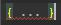

\pagebreak
# Java
Een inleiding tot het programmeren in Java.

Deze reader is een afgeleide van het Wikibook: Programmeren in Java,
voor meer informatie zie de website van Wikibooks --
[[http://wikibooks.nl]{.underline}](http://wikibooks.nl/)

Aanvullende bronnen:

[[http://thenewboston.org]{.underline}](http://thenewboston.org/) --
Youtube films over diverse onderwerpen, waaronder Java
[[http://docs.oracle.com/javase/tutorial/]{.underline}](http://docs.oracle.com/javase/tutorial/) -
Officiële documentatie van Oracle

## Wat is een programmeertaal?

Om een computer te \'\'programmeren\'\', ofwel verschillende instructies
achter elkaar zetten in een \'\'programma\'\', moest men vroeger veel
werk verrichten. Een computer werkt namelijk binair (met enen en
nullen). Om een programma te schrijven moest men dus een heel lange
serie van enen en nullen achter elkaar zetten. Dit is echter een zeer
tijdrovende bezigheid, en het gevolg was dat er niet veel programma\'s
waren en dat het schrijven van een nieuw programma zeer veel tijd in
beslag nam. Daarom heeft men de \'\'programmeertaal\'\' uitgevonden, die
programmeren een stuk eenvoudiger maakt.

Programmeertalen zijn eigenlijk niets anders dan versimpelde instructies
die in een keer heel veel nullen en enen voor ons neerzetten. Deze
instructies zijn ook een stuk makkelijker te begrijpen dan een reeks
getallen.

## Compileren en de kracht van Java

Zoals eerder gezegd, een computer verstaat alleen enen en nullen. Dus
hoe kan een computer ooit een programma uitvoeren in een programmeertaal
met complexe dingen zoals objecten? Het antwoord is vrij simpel: voordat
je iets met een programma kan doen, moet de code eerst worden omgezet
naar enen en nullen. Dit proces heet \'\'compileren\'\'.

Bij een \"klassieke\" programmeertaal, bijvoorbeeld C++, wordt de
programmacode omgezet naar code die direct door een computer te
begrijpen is. Dat is uiteraard gemakkelijk, want er is geen extra
programma nodig om de code uit te voeren. Maar dit betekent wel dat code
die voor een systeem is geschreven (bv. Microsoft Windows) niet werkt op
andere systemen (bv. Apple Mac OS of Linux). Er moeten dus aparte
versies voor die systemen gecompileerd worden, en vaak dient de
programmacode eerst worden aangepast omdat deze systemen anders werken.

Met Java is het de bedoeling om platformonafhankelijke programma\'s te
maken. Dat wil zeggen dat een programma dat je thuis maakt in Java zal
draaien op jouw besturingssysteem, maar ook op andere besturingssystemen
als Linux of MAC OS X, \...

Java lost dit probleem op door gebruik te maken van een compiler die
weliswaar een binair bestand aanmaakt, maar waarin de opdrachten nog
steeds platformonafhankelijk zijn. In plaats van de broncode
rechtstreeks om te zetten naar machinetaal, zoals bij C of C++ e.d. het
geval is. Dit heeft tot gevolg dat de Java-compiler geen
\'\'stand-alone\'\' uitvoerbaar bestand (een .exe onder Microsoft
Windows) maakt. In de plaats daarvan compileert de Java-compiler een
bestand in bytecode. Dit bestand wordt dan ingelezen door een
\'\'interpreter\'\' (\'\'Java Virtual Machine\'\', JVM) dat op elk
platform waar Java programma\'s op moeten draaien geïnstalleerd moet
worden. De JVM leest de bytecode, interpreteert de opdrachten en voert
dan het programma uit.

*Java-programma → bytecode → machinetaal*

# Een inleiding tot het programmeren in Java

De JVM is wel degelijk afhankelijk van het platform, maar is beschikbaar
voor veel verschillende systemen, is gratis en hoeft slechts eenmalig te
worden geïnstalleerd.

Het uitvoeren van bytecode gaat weliswaar iets trager dan het doorsnee
\'native\' programma, oftewel een programma dat specifiek voor één
systeem is geschreven (onder Microsoft Windows een .exe), maar dit is in
het dagelijks gebruik nauwelijks merkbaar. Het voordeel is echter dat je
niet afhankelijk bent van beslissingen van de softwareontwikkelaar om
een programma voor jouw systeem al dan niet te ontwikkelen.

IntelliJ IDEA Ultimate

Om te programmeren in Java gaan we gebruik maken van een van de vele
Jetbrains IDE's. Een IDE is eigenlijk een hele slimme tekstverwerker die
je helpt door foute code te corrigeren en automatisch de opmaak/kleuren
toe te passen.

Ga naar [[https://www.jetbrains.com]{.underline}](https://www.jetbrains.com/) en
maak daar een account aan [met jouw **persoonlijke school-mail
adres**]{.underline}. Vervolgens is het mogelijk om een
studentenlicentie aan te vragen.

Je kan ervoor kiezen om de Jetbrains Toolbox te installeren als je
meerdere programma's van het pakket wil uitproberen of je kan alleen
**IntelliJ IDEA Ultimate** installeren, dit is het programma dat we
gebruiken voor de de Java opdrachten.

Opdrachten

Sla de opdrachten goed op, zodat je ze later aan de docent kan laten
zien.

**Tip: Sla per hoofdstuk de opdrachten op in een map en geef de
opdrachten de naam van de opgave.**

# 1. Hallo Wereld!

We gaan nu ons eerste Java programma schrijven. Daarna gaan we het
programma compileren.

Start IntelliJ IDEA Ultimate op en maak een nieuw project:

**FILE -\> NEW-\> PROJECT-\> JAVA -\> (NEXT) -\> CREATE FROM TEMPLATE \>
COMMAND LINE APP**

Zorg ervoor dat je eerste project HalloWereld heet, gebruik geen spaties
voor projectnamen. Neem vervolgens dit eerste stukje code over:

{width="6.269444444444445in"}

> public class Main {

{width="6.065972222222222in"}

```java
public static void main(String[] args) {
  System.out.println("Hello World!");
}
```

{width="6.065972222222222in"}

{width="6.065972222222222in"
height="0.15694444444444444in"}

{width="6.065972222222222in"
height="0.15694444444444444in"}

## Compileren

Wanneer je vanuit een commandolijn-omgeving (DOS-prompt, UNIX-shell,
Windows: Start \> Run \> typ \"cmd\" \...) werkt, ga je nu naar de map
waar het bestand Hallo.java staat. Daar typ je het volgende commando:

{width="6.269444444444445in"
height="0.4083333333333333in"}

> javac Hallo.java

**Vanuit IntelliJ kan je als alternatief heel eenvoudig op de groene**
{width="0.2708333333333333in"}
**knop drukken, het resultaat wordt
onder je code weergegeven**

## Bespreking

{width="6.269444444444445in"
height="1.0368055555555555in"}

```java
public class Main {
  public static void main(String[] args) {

    System.*out*.println("Hello World!");
  }
}
```

{width="5.815972222222222in"}

Op regel 1 maken we een nieuwe klasse aan. De public duidt erop dat deze
code in het bestand moet zitten met dezelfde naam als de klasse, gevolgd
door .java. In dit geval dus Hallo.java. Meer over klassen vind je in
het hoofdstuk Klassen.

Op regel twee zien we de 'main methode'. Dit is een standaard methode
waar een programma

begint. Schrijf dus al je code binnen de accolades
{width="0.6354166666666666in"} van deze methode.

Op regel 3 roepen we een methode op uit de standaard Java code, namelijk
de methode println. Deze drukt de meegegeven tekst af in de console. De
tekst die meegeeft moet tussen haakjes en tussen aanhalingstekens. In
plaats van tekst kan je ook variabelen afdrukken. Daarvoor moet je de
naam van de variabele die je wilt afdrukken tussen de haakjes zetten,
zonder aanhalingstekens.

Regel 4 en 5 sluiten respectievelijk de main methode en de klasse Hallo
terug af. Dit is verplicht. Tip: Het is een goede gewoonte om wanneer je
het begin van bijvoorbeeld een methode schrijft ook onmiddellijk de
afsluitende accolade te schrijven. Als je een IDE gebruikt, is dit
echter niet nodig.

Opdrachten Hoofdstuk 1

Opdracht 1; Druk je volledige naam af op het scherm

Voorbeeld:

{width="4.677083333333333in"}

Opdracht 2; Druk je volledige naam, gescheiden door enters af op het
scherm.

Voorbeeld:

{width="4.84375in"}

# 2. Variabelen
Variabelen kunnen we gebruiken om tijdelijk gegevens in op te slaan.
Deze gegevens kunnen bijvoorbeeld bestaan uit getallen (integers) of
stukken tekst (strings), maar kunnen bijvoorbeeld ook waar/niet waar
gegevens (booleans) of een reeks gegevens (array) bevatten. Eigenlijk
alles wat we in PHP kunnen aanmaken, kunnen we in een variabele zetten.

Nu willen we toch graag wat meer doen dan enkel een tekst weergeven. We
zullen ons eerste programma een beetje opfleuren met een wiskundige
berekeningen:

{width=6.269444444444445in}

```java
public class Main {

  public static void main(String\[\] args) {
    
    int a;
    int b;
    int c;

    a = 1;
    b = 2;
    c = a + b;

    System.*out*.println(\"1 + 2 = \" + c);
  }
}
```

{width="5.815972222222222in"}

Op regel 3 tot 5 maken we drie variabelen aan met respectievelijk de
namen a, b en c. Dit doen we via het sleutelwoord int, wat de afkorting
is voor integer (je mag echter nooit integer voluit schrijven bij
declaratie van een variabele). Dit sleutelwoord bepaalt welk soort
variabele we aanmaken.

Het aanmaken van een variabele noemen we declareren. Het vertelt de
compiler dat we een variabele gaan gebruiken met een bepaalde naam en
van een welbepaald type. Het declareren van variabelen is in Java
verplicht. Als dat niet gebeurt, dan levert dat een foutmelding op
tijdens het compileren.

We kunnen nog op een andere manier een reeks variabelen van hetzelfde
type declareren door regel 3 tot 5 te schrijven als:

{width="6.269444444444445in"
height="0.4083333333333333in"}

> int a,b,c;

Deze laatste manier zorgt voor iets compactere code, maar is verder
identiek.

Op regel 6 en 7 geven we zowel de variabele a als b een waarde. Men mag
niet eender wat na het is gelijk aanteken zetten (zie verder). De actie
die we ondernemen heet initialiseren omdat we voor de eerste keer de
variabelen een waarde toekennen. Het is gelijk aanteken noemen we de
toekenningsoperator en lees je best als \"wordt\" (en niet als \"is\").

Op regel 8 initialiseren we de variabele c. Niet met een door ons
bepaalde waarde maar met de som van de twee variabelen a en b. Het
plusteken is een wiskundige operator.

Op regel 9 tonen we een woord op het scherm zoals we eerder al deden.
Dat woord is \"1 + 2 = \". Daarna schrijven we een plusteken. Dit keer
is de plus geen wiskundige operator maar een speciale
\"concatenatie\"-operator die voor het aaneenzetten van tekst wordt
gebruikt (zie het hoofdstuk over Stringbewerkingen).


In Java zitten een paar vaste sleutelwoorden zoals int die bepaalde
types van variabelen bevatten. Variabelen die niet meer doen dan één
bepaalde waarde opslaan noemen we primitieve variabelen. Deze zijn door
Java gedefinieerd en de programmeur kan er geen nieuwe bijmaken. Er zijn
in totaal negen primitieve variabelen. Iedere soort staat voor een eigen
type. Hieronder zie je alle primitieve typen:

Primitieve variabelentypes

+----------+----------------+---+---------------------+--------------+
| >        | >              | > | > **Bereik**        | > *          |
| **Sleute |  **Betekenis** |   |                     | *Voorbeeld** |
| lwoord** |                | * |                     |              |
|          |                | * |                     |              |
|          |                | B |                     |              |
|          |                | i |                     |              |
|          |                | t |                     |              |
|          |                | s |                     |              |
|          |                | * |                     |              |
|          |                | * |                     |              |
+----------+----------------+---+---------------------+--------------+
| > **b    | > booleaanse   | > | > true of false     | > boolean a  |
| oolean** | > waarde       |   |                     | > = true;    |
|          |                | 1 |                     |              |
+----------+----------------+---+---------------------+--------------+
| >        | > heel klein   | > | > -128 (-2^7^) tot  | > byte b =   |
| **byte** | > geheel getal |   | > 127 (2^7^ - 1)    | > 8;         |
|          |                | 8 |                     |              |
+----------+----------------+---+---------------------+--------------+
| >        | > karakter     | > | > Alle              | > char c =   |
| **char** |                |   | > Unicode-tekens    | > \'a\';     |
|          |                | 1 |                     |              |
|          |                | 6 |                     |              |
+----------+----------------+---+---------------------+--------------+
| > *      | > klein geheel | > | > -32768 (-2^15^)   | > short d =  |
| *short** | > getal        |   | > tot               | > 658;       |
|          |                | 1 |                     |              |
|          |                | 6 |                     |              |
+----------+----------------+---+---------------------+--------------+
|          |                |   | > 32767 (-2^15^ -   |              |
|          |                |   | > 1)                |              |
+----------+----------------+---+---------------------+--------------+
| >        | > geheel getal | > | > -2147483648       | > int e =    |
|  **int** |                |   | > (-2^31^) tot      | > 2000000;   |
|          |                | 3 |                     |              |
|          |                | 2 |                     |              |
+----------+----------------+---+---------------------+--------------+
|          |                |   | > 2147483647        |              |
|          |                |   | > (2^31^ - 1)       |              |
+----------+----------------+---+---------------------+--------------+
| >        | > groot geheel | > | > -2^63^ tot        | > long f =   |
| **long** | > getal        |   | > 2^63^ - 1         |              |
|          |                | 6 |                     |              |
|          |                | 4 |                     |              |
+----------+----------------+---+---------------------+--------------+
|          |                |   |                     | > 220000000; |
+----------+----------------+---+---------------------+--------------+
| > *      | > reëel getal  | > | > ±0,14 \* 10^-64^  | > float g =  |
| *float** |                |   | > tot               | > 89567;     |
|          |                | 3 |                     |              |
|          |                | 2 |                     |              |
+----------+----------------+---+---------------------+--------------+
|          |                |   | > ±0,34 \* 10^39^   |              |
+----------+----------------+---+---------------------+--------------+
| > **     | > reëel getal  | > | > ±0,49 \* 10^-325^ | > double h = |
| double** |                |   | > tot               |              |
|          |                | 6 |                     |              |
|          |                | 4 |                     |              |
+----------+----------------+---+---------------------+--------------+
|          | > (dubbele     |   | > ±0,18 \* 10^309^  | > 1000.987;  |
|          | > precisie)    |   |                     |              |
+----------+----------------+---+---------------------+--------------+
| >        | > niets        | > | > \-                | > void       |
| **void** |                |   |                     | > methode()  |
|          |                | \ |                     | > { }        |
|          |                | - |                     |              |
+----------+----------------+---+---------------------+--------------+
| > **     | > verzameling  |   |                     | > String     |
| String** | > karakters    |   |                     | > groet =    |
+----------+----------------+---+---------------------+--------------+
|          |                |   |                     | > "Hallo!1"; |
+----------+----------------+---+---------------------+--------------+

## Opdrachten Hoofdstuk 2

Bij deze opdrachten moet je

1.  de gegevens in het juiste type variabele stoppen

2.  vervolgens de variabele afdrukken op het scherm.

Bijvoorbeeld:

byte opdracht1 = 8;

System.*out*.println(opdracht1);

String opdracht2 = \"Naam\";

System.*out*.println(opdracht2);

Opdracht 3; Java Rules!

Opdracht 4; -127

Opdracht 5; 8,99882

Opdracht 6; G3tal

# 3. Operator
Operators zijn tekens die ons verschillende bewerkingen of
vergelijkingen laten doen.

De eerste categorie zijn wiskundige operators **(+, -, \*, /, %)**. Deze
zijn eigenlijk alleen maar aanwezig om te rekenen met getallen.
Uiteraard zijn we bekend met optellen, aftrekken, vermenigvuldigen en
delen maar het procentteken is ook aanwezig als een restdeling (een
speciale manier van delen). We gaan in de opdrachten geen restdelingen
doen maar dan weet je dat deze wel aanwezig is!

De tweede categorie zijn relationele operators. Dit zijn vergelijkingen
**(==, \>, \<, !=)**. Hier ben je misschien minder bekend mee. Deze
operators gebruiken we om te kijken of variabelen met elkaar
overeenkomen of dat ze verschillend zijn. Als we bijvoorbeeld willen
weten of een ingevoerd wachtwoord overeenkomt met het opgeslagen
wachtwoord schrijven we:

```java
if(password == savedPassword){

  //password is OK
}
```

Een (kleine) extra categorie is het + teken voor strings (teksten). Als
we een + gebruiken voor twee teksten dan worden de teksten aan elkaar
geplakt.

Hier onder vind je een greep uit de meest gebruikte operatoren van Java
en hun betekenis. **Kijk bij toekomstige opdrachten weer naar deze
tabel!**

Betekenis operatoren

+---+--------+-------------------------------------+----------------------+---+
|   | >      | > **Betekenis**                     | > **Voorbeeld**      |   |
|   |  **Sym |                                     |                      |   |
|   | bool** |                                     |                      |   |
+---+--------+-------------------------------------+----------------------+---+
|   | >      | > Een waarde toekennen aan een      | > a = 5;             |   |
|   |  **=** | > variabele                         |                      |   |
+---+--------+-------------------------------------+----------------------+---+
|   | > **De |                                     |                      |   |
|   | > var  |                                     |                      |   |
|   | iabele |                                     |                      |   |
|   | > a    |                                     |                      |   |
|   | > (    |                                     |                      |   |
|   | eerder |                                     |                      |   |
|   | > g    |                                     |                      |   |
|   | edecla |                                     |                      |   |
|   | reerd) |                                     |                      |   |
|   | >      |                                     |                      |   |
|   | krijgt |                                     |                      |   |
|   | >      |                                     |                      |   |
|   | waarde |                                     |                      |   |
|   | > 5**  |                                     |                      |   |
+---+--------+-------------------------------------+----------------------+---+
|   | >      | > Waarden/Variabelen bij elkaar     | > b = a + 1;         |   |
|   |  **+** | > optellen                          |                      |   |
+---+--------+-------------------------------------+----------------------+---+
|   | > **De |                                     |                      |   |
|   | > var  |                                     |                      |   |
|   | iabele |                                     |                      |   |
|   | > b    |                                     |                      |   |
|   | >      |                                     |                      |   |
|   | krijgt |                                     |                      |   |
|   | > de   |                                     |                      |   |
|   | >      |                                     |                      |   |
|   | waarde |                                     |                      |   |
|   | > van  |                                     |                      |   |
|   | > (a + |                                     |                      |   |
|   | > 1),  |                                     |                      |   |
|   | > hier |                                     |                      |   |
|   | > dus  |                                     |                      |   |
|   | > 6**  |                                     |                      |   |
+---+--------+-------------------------------------+----------------------+---+
|   | >      | > Waarden/Variabelen van elkaar     | > c = b - a;         |   |
|   |  **-** | > aftrekken                         |                      |   |
+---+--------+-------------------------------------+----------------------+---+
|   | > **c  |                                     |                      |   |
|   | >      |                                     |                      |   |
|   | krijgt |                                     |                      |   |
|   | > de   |                                     |                      |   |
|   | >      |                                     |                      |   |
|   | waarde |                                     |                      |   |
|   | > van  |                                     |                      |   |
|   | > het  |                                     |                      |   |
|   | > ve   |                                     |                      |   |
|   | rschil |                                     |                      |   |
|   | >      |                                     |                      |   |
|   | tussen |                                     |                      |   |
|   | > b en |                                     |                      |   |
|   | > a,   |                                     |                      |   |
|   | > hier |                                     |                      |   |
|   | > dus  |                                     |                      |   |
|   | > 1**  |                                     |                      |   |
+---+--------+-------------------------------------+----------------------+---+
|   | >      | > Vermenigvuldigen                  | > d = c \* 5;        |   |
|   | **\*** |                                     |                      |   |
+---+--------+-------------------------------------+----------------------+---+
|   | > **d  |                                     |                      |   |
|   | >      |                                     |                      |   |
|   | krijgt |                                     |                      |   |
|   | > de   |                                     |                      |   |
|   | >      |                                     |                      |   |
|   | waarde |                                     |                      |   |
|   | > van  |                                     |                      |   |
|   | > c    |                                     |                      |   |
|   | > ver  |                                     |                      |   |
|   | menigv |                                     |                      |   |
|   | uldigd |                                     |                      |   |
|   | > met  |                                     |                      |   |
|   | > 5,   |                                     |                      |   |
|   | > hier |                                     |                      |   |
|   | > dus  |                                     |                      |   |
|   | > 5**  |                                     |                      |   |
+---+--------+-------------------------------------+----------------------+---+
|   | >      | > Delen of                          | > e = d / 10;        |   |
|   |  **/** |                                     |                      |   |
+---+--------+-------------------------------------+----------------------+---+
|   | > **e  |                                     |                      |   |
|   | >      |                                     |                      |   |
|   | krijgt |                                     |                      |   |
|   | > de   |                                     |                      |   |
|   | >      |                                     |                      |   |
|   | waarde |                                     |                      |   |
|   | > van  |                                     |                      |   |
|   | > d    |                                     |                      |   |
|   | > g    |                                     |                      |   |
|   | edeeld |                                     |                      |   |
|   | > door |                                     |                      |   |
|   | > 10,  |                                     |                      |   |
|   | > hier |                                     |                      |   |
|   | > dus  |                                     |                      |   |
|   | >      |                                     |                      |   |
|   |  0.5** |                                     |                      |   |
+---+--------+-------------------------------------+----------------------+---+
|   | >      | > \"Is linkerlid gelijk aan         | > boolean m = (5 ==  |   |
|   | **==** | > rechterlid?\"                     | > 6);                |   |
+---+--------+-------------------------------------+----------------------+---+

> **m zal false zijn omdat 5 niet gelijk is aan zes, de == geeft een
> boolean als resultaat (true of false).**

+---+--------+-------------------------------------+----------------------+---+
|   | >      | > \"Is linkerlid verschillend aan   | > boolean n = (5 !=  |   |
|   | **!=** | > rechterlid?\"                     | > 6);                |   |
+---+--------+-------------------------------------+----------------------+---+
|   | > **n  |                                     |                      |   |
|   | > zal  |                                     |                      |   |
|   | > true |                                     |                      |   |
|   | > z    |                                     |                      |   |
|   | ijn.** |                                     |                      |   |
+---+--------+-------------------------------------+----------------------+---+
|   | >      | > \"Is linkerlid groter dan         | > boolean o = (5 \>  |   |
|   | **\>** | > rechterlid?\"                     | > 6);                |   |
+---+--------+-------------------------------------+----------------------+---+
|   | > **o  |                                     |                      |   |
|   | > zal  |                                     |                      |   |
|   | >      |                                     |                      |   |
|   |  false |                                     |                      |   |
|   | > z    |                                     |                      |   |
|   | ijn.** |                                     |                      |   |
+---+--------+-------------------------------------+----------------------+---+
|   | > *    | > \"Is linkerlid groter dan of      | > boolean p = (4 \>= |   |
|   | *\>=** | > gelijk aan rechterlid?\"          | > 4);                |   |
+---+--------+-------------------------------------+----------------------+---+
|   | > **p  |                                     |                      |   |
|   | > zal  |                                     |                      |   |
|   | > true |                                     |                      |   |
|   | > z    |                                     |                      |   |
|   | ijn.** |                                     |                      |   |
+---+--------+-------------------------------------+----------------------+---+
|   | >      | > \"Is linkerlid kleiner dan        | > boolean q = (5 \<  |   |
|   | **\<** | > rechterlid?\"                     | > 6);                |   |
+---+--------+-------------------------------------+----------------------+---+
|   | > **q  |                                     |                      |   |
|   | > zal  |                                     |                      |   |
|   | > true |                                     |                      |   |
|   | > z    |                                     |                      |   |
|   | ijn.** |                                     |                      |   |
+---+--------+-------------------------------------+----------------------+---+
|   | > *    | > \"Is linkerlid kleiner dan of     | > boolean r = (6 \<= |   |
|   | *\<=** | > gelijk aan rechterlid?\"          | > 5);                |   |
+---+--------+-------------------------------------+----------------------+---+
|   | > **r  |                                     |                      |   |
|   | > zal  |                                     |                      |   |
|   | >      |                                     |                      |   |
|   |  false |                                     |                      |   |
|   | > z    |                                     |                      |   |
|   | ijn.** |                                     |                      |   |
+---+--------+-------------------------------------+----------------------+---+


## Auto-increment operatoren

Je hebt ook nog de auto-increment- en auto-decrementoperatoren. Dit zijn
operatoren die je kan gebruiken om een variabele met 1 te verhogen of te
verlagen. Ze zien er zo uit: ++ en \--. Je kan ze voor of na een
variabele zetten (zonder spatie gescheiden) om deze variabele te
bewerken (Bvb. \"i++;\" zal de variabele i met 1 verhogen, \"j\--;\" zal
j met 1 verlagen). Bemerk het verschil in gedrag wanneer de operator
voor (preincrementie) of na (postincrementie) de variabele staat.

*Voorbeelden*

{width="6.269444444444445in"
height="1.9805555555555556in"}

> public class IncrementKort {
>
> public static void main(String\[\] args) {

{width="6.065972222222222in"
height="0.15694444444444444in"}

+-----------+----+---------+------------------------------------------+
| > int     | a  |         | > d;                                     |
|           | =  |         |                                          |
|           | 1, |         |                                          |
|           | b  |         |                                          |
|           | =  |         |                                          |
|           | 2, |         |                                          |
|           | c, |         |                                          |
+-----------+----+---------+------------------------------------------+
| > c =     | ++ | // a =  | > 2, c = 2                               |
|           | a; |         |                                          |
+-----------+----+---------+------------------------------------------+
| > c =     | a+ | // a =  | > c = 2 (!)                              |
|           | +; | 3,      |                                          |
+-----------+----+---------+------------------------------------------+
| > d =     |    | > // b  |                                          |
| > \--b;   |    | > = 1,  |                                          |
|           |    | > d = 1 |                                          |
+-----------+----+---------+------------------------------------------+
|           |    |         |                                          |
+-----------+----+---------+------------------------------------------+
| > \--b;   |    | // b =  | > 0                                      |
+-----------+----+---------+------------------------------------------+
| > ++b;    |    | // b =  | > 1                                      |
+-----------+----+---------+------------------------------------------+
| > b++;    |    | // b =  | > 2                                      |
+-----------+----+---------+------------------------------------------+

{width="6.065972222222222in"}

{width="6.065972222222222in"}

{width="6.065972222222222in"}

## Opdrachten Hoofdstuk 3

Bij deze opdrachten moet je:

1.  de gegevens in de juiste type variabele stoppen

2.  De bewerking uitvoeren

3.  het resultaat van de bewerking afdrukken op het scherm.

Voorbeeld:

int getal1 = 8698765;

int getal2 = 10675632;

int resultaat = getal1 \* getal2;

System.*out*.println(resultaat);

Opdracht 7; 8 keer 9

Opdracht 8; 99383 + 884848

Opdracht 9; 11 met 1 verhogen

Opdracht 10; 5595 delen door 998

Opdracht 11; 2999299929292 vermenigvuldigen met 4,2

Opdracht 12; 12 minus 66


# 4. Statements

Nu we een beetje weten hoe we met variabelen in Java kunnen werken, is
het tijd om iets verder te gaan kijken. Alles wat we tot nu toe gezien
hebben, zouden we in principe ook nog met simpele code kunnen bereiken.
Laten we nu eens wat dieper ingaan op een van de dynamische aspecten van
Java.

If/else statements

Statement is het Engels voor \'voorwaarde\' en wordt zeer veel in Java
gebruikt. Met Java is het mogelijk om verschillende acties uit te voeren
afhankelijk van de uitkomst van een bepaalde voorwaarde. De meest
simpele voorwaarde die we kunnen stellen is de vergelijking van twee
waarden. Zo zou je Java bijvoorbeeld kunnen laten bepalen of een
variabele groter of kleiner is dan 5 en afhankelijk daarvan een reactie
geven.

Het gebruik van if gaat als volgt:

{width="6.269444444444445in"
height="0.40902777777777777in"}

```java
if(<boolean>){ ... }
```

Tussen de accolades komt de code die moet worden uitgevoerd als de
boolean true is. De boolean kan je verkrijgen uit het resultaat van
bijvoorbeeld de == operator. Je kijkt of het resultaat van de bewerking
true is en voert vervolgens een gewenste bewerking uit. Zo zal code
onder \"if(4 \< 5) { \... }\" altijd uitgevoerd worden (daar 4 altijd
kleiner is dan 5).

Let erop dat tussen de accolades een willekeurige hoeveelheid
programmacode kan komen (net zoals de accolades bij een methode). Tussen
de accolades vind je namelijk een code block. Dat is een blok waarbinnen
je code kan groeperen. Als het if-statement true evalueert zal hij de
volledige blok code tussen de accolades uitvoeren.

Na een if kan je else gebruiken om de code te bepalen die enkel wordt
uitgevoerd indien de boolean false was:

{width="6.269444444444445in"
height="1.5083333333333333in"}

```java
if (<boolean>) {
   ...
}
else {
  ...
}

Je ziet dat er bij else geen nieuwe boolean gevraagd wordt. Een
else-statement komt altijd onmiddellijk na een if-statement. Tenzij je
gebruik maakt van "else if" op de volgende manier:

{width="6.269444444444445in"
height="2.1381944444444443in"}

```java
if(\<boolean\>)
{
  ...
}
elseif(\<boolean2\>) {
  ...
}
else {
  ...
}
```

Voorbeeld

{width="6.269444444444445in"
height="2.6104166666666666in"}

```java
public class AbsoluutVerschil {

  public static void main(String\[\] args) {

    int a = 19, b = 9;

    int verschil = 0;
    
    if (a \> b) {
      verschil = a - b;
    } else {
      verschil = b - a;
    }
    
    System.*out*.println(\"Verschil tussen \" + a + \" en \" + b + \" is: \" + verschil);
  }
}
```

{width="5.815972222222222in"
height="0.6284722222222222in"}

In bovenstaand programma kan zowel a groter zijn dan b of b groter dan
a. Het zal niets echter niets uitmaken voor het verschil.

Op regel 6 zien we de vergelijking a \> b. We maken gebruik van de
\"groter dan\" relationele operator die als resultaat een boolean heeft
en dus geschikt is om tussen haakjes van if te staan.

Op regel 7 zien we wat er moet gebeuren indien a groter is dan b. Dan
trekken we b van a af zodat het resultaat positief blijft. Indien b
groter is dan a moet het omgekeerde gebeuren. Dat zien gebeurt op regel
8 en 9.

Op regel 8 zien we dat de sluitende accolade van het if-statement op
dezelfde regel staat als het begin van het else-statement. Dit is een
kwestie van stijl, je kan de else ook een regel eronder beginnen. De
java compiler is daar blind voor.

Op regel 12 en 13 schrijven we de waarde van de twee variabelen en hun
onderling verschil uit.

## Opdrachten Hoofdstuk 4

Opdracht 13; Vul een variabele met een getal, mocht dit getal groter
zijn dan 10, druk dan een foutmelding af op het scherm.

Opdracht 14; Vul een variabele met een getal, mocht dit getal kleiner of
gelijk zijn als 5,5, druk dan een melding af op het scherm dat het
behaalde cijfer een onvoldoende is. In het andere getal is er een
voldoende behaald.

Opdracht 15; Nu combineren we de twee. Vul een variabele met een getal,
als het onder de 0 of boven de 10 is moet er een foutmelding
verschijnen. Onder de 5,5 moet er een melding zijn op het scherm dat het
een onvoldoende is, Daarboven een voldoende. Voor deze opdracht mag er
maar 1 melding per keer verschijnen.

# 5. Lussen

Een andere constructie waarbij het dynamische aspect van Java naar voren
komt, is de lus. Dit is een constructie waarbij een bepaald stuk code
herhaaldelijk uitgevoerd wordt tot aan een bepaald statement wordt
voldoen. Er zijn verschillende soorten lussen die we kunnen gebruiken.
Ik zal de twee die het meest gebruikt worden, de while-lus en de for-lus
hier bespreken.

For-lus

Met de for-lus kun je een gecontroleerde herhaling laten plaats vinden.

```java
public class ForTest1 {

  public static void main (String args\[\]) {
    
    for (int i=0; i \< 5; i++) {
      System.*out*.println ("i heeft de waarde "+i);
    }
  }
}
```

Ook kan je in grotere hoeveelheden dan 1 door een loop heen:

```java
public static void main(String\[\] args) {
  for (int i = 0; i \< 25; i = i + 5) {
    System.*out*.println("i heeft de waarde " + i);
  }
}
```

While-lus

Zolang aan *statement* voldaan wordt, zal de code in de loop, die
wederom tussen accolades {} staat, telkens opnieuw uitgevoerd worden.
Vaak wordt een while-loop in combinatie met een tellertje gebruikt,
bijvoorbeeld om de getallen 1-5 weer te geven:

```java
public class WhileTest {

  public static void main(String\[\] args) {
    int i=0;
    System.*out*.println("i heeft de waarde "+i); 
    
    while (i<5) {
      i++;
      System.*out*.println("plus 1 is "+i);
    }

    System.*out*.println("Aan het einde van deze lus heeft i de waarde +i");
  }
}
```

## Opdrachten Hoofdstuk 5

Opdracht 16; Druk de getallen 1 t/m 5 onder elkaar af op het scherm met
behulp van een **for**-lus

Opdracht 17; Druk de getallen 10 t/m 15 achter elkaar af op het scherm
met een **while**-lus.

Opdracht 18; Druk de getallen 36 t/m 28 achter elkaar af op het scherm
met een **for**-lus.

Opdracht 19; Druk de getallen 19 tot 31 per tweetal achter elkaar af op
het scherm (19, 21, 23 etc.)

Opdracht 20; Druk de getallen 4192 tot -2039 per 150 tal af op het
scherm (4192, 4042, 3892 etc.)

# 6. Invoer vanaf het toetsenbord

Voor het verwerken van gegevens is het handig als je de gebruiker om
gegevens kan vragen.

Uiteraard kan dit ook met Java. Zie onderstaand voorbeeld:

{width="6.269444444444445in"}

-   Importeer de benodigde onderdelen. 

```java
import java.util.Scanner;

public class invoer {
  public static void main(String\[\] args) {
```

-   Maak een nieuwe variabele aan van het type string: String invoer;

```java
Scanner scanner = new Scanner(System.*in*);

System.*out*.print(\"Geef je naam op:\");
```

{width="6.065972222222222in"}

-   De variable invoer vullen: invoer = scanner.nextLine();

-   Uitvoer naar het beeldscherm: System.*out*.println(\"Hallo \" +
    invoer);

{width="6.065972222222222in"
height="0.7868055555555555in"}

> }

{width="6.065972222222222in"
height="0.15833333333333333in"}

> }

{width="6.065972222222222in"
height="0.15694444444444444in"}

Uitwerking:

{width="5.59375in" height="2.03125in"}

Voor het invoeren van getallen kan je ook onderstaand voorbeeld
gebruiken:

{width="6.269444444444445in"
height="0.17152777777777778in"}

> int invoer = scanner.nextInt();

## Opdrachten Hoofdstuk 6

Opdracht 21; Vraag de gebruiker om zijn naam in te voeren, druk daarna
zijn naam af op het scherm.

Opdracht 22; Vraag de gebruiker om een getal groter dan 1, druk de
voorgaande getallen af op het scherm.

Voorbeeld:

{width="5.03125in"
height="1.6354166666666667in"}

Opdracht 23; Vraag de gebruiker om zijn naam en leeftijd, druk hierna
zijn naam zoveel keer als zijn leeftijd af op het scherm.

Voorbeeld:

{width="4.895833333333333in"
height="2.03125in"}

# Eindopdracht

Voor de eindopdracht moet je de volgende figuren met loops proberen af
te drukken:

+-----------------------+-----------------------+-----------------------+
| > Figuur 1            | > Figuur 2            | > Figuur 3            |
+-----------------------+-----------------------+-----------------------+
|                       |                       |                       |
+-----------------------+-----------------------+-----------------------+
| > **\***              | > **\***              | > **\*\*\*\*\***      |
+-----------------------+-----------------------+-----------------------+
| > **\***              | > **\*\***            | > **\*\*\*\***        |
+-----------------------+-----------------------+-----------------------+
| > **\***              | > **\*\*\***          | > **\*\*\***          |
+-----------------------+-----------------------+-----------------------+
| > **\***              | > **\*\*\*\***        | > **\*\***            |
+-----------------------+-----------------------+-----------------------+
| > **\***              | > **\*\*\*\*\***      | > **\***              |
+-----------------------+-----------------------+-----------------------+
|                       |                       |                       |
+-----------------------+-----------------------+-----------------------+
| > Figuur 4            | > Figuur 5            | > Figuur 6            |
+-----------------------+-----------------------+-----------------------+
|                       |                       |                       |
+-----------------------+-----------------------+-----------------------+
| > **11111**           | > **1**               | > **11111**           |
+-----------------------+-----------------------+-----------------------+
| > **22222**           | > **22**              | > **2222**            |
+-----------------------+-----------------------+-----------------------+
| > **33333**           | > **333**             | > **333**             |
+-----------------------+-----------------------+-----------------------+
| > **44444**           | > **4444**            | > **44**              |
+-----------------------+-----------------------+-----------------------+
| > **55555**           | > **55555**           | > **5**               |
+-----------------------+-----------------------+-----------------------+
|                       |                       |                       |
+-----------------------+-----------------------+-----------------------+

Extra opdrachten lussen (voor diegene die van een uitdaging houden,
**optionele opdrachten!**):

+-----------------------+-----------------------+-----------------------+
| > Figuur 7            | > Figuur 8            | > Figuur 9            |
+-----------------------+-----------------------+-----------------------+
|                       |                       |                       |
+-----------------------+-----------------------+-----------------------+
| **\***                | **1**                 | **\***                |
+-----------------------+-----------------------+-----------------------+
| **\*\***              | **12**                | **\*\*\***            |
+-----------------------+-----------------------+-----------------------+
| **\*\*\***            | **123**               | **\*\*\*\*\***        |
+-----------------------+-----------------------+-----------------------+
| **\*\*\*\***          | **1234**              | **\*\*\*\*\*\*\***    |
+-----------------------+-----------------------+-----------------------+
| **\*\*\*\*\***        | **123456**            | *                     |
|                       |                       | *\*\*\*\*\*\*\*\*\*** |
+-----------------------+-----------------------+-----------------------+
|                       | **1234567**           | **\*\                 |
|                       |                       | *\*\*\*\*\*\*\*\*\*** |
+-----------------------+-----------------------+-----------------------+
|                       | **12345678**          | **\*\*\*\             |
|                       |                       | *\*\*\*\*\*\*\*\*\*** |
+-----------------------+-----------------------+-----------------------+
|                       |                       |                       |
+-----------------------+-----------------------+-----------------------+
| > Figuur 10           | > Figuur 11           |                       |
+-----------------------+-----------------------+-----------------------+
|                       |                       |                       |
+-----------------------+-----------------------+-----------------------+
| **1**                 | **1**                 |                       |
+-----------------------+-----------------------+-----------------------+
| **121**               | **232**               |                       |
+-----------------------+-----------------------+-----------------------+
| **12321**             | **34543**             |                       |
+-----------------------+-----------------------+-----------------------+
| **1234321**           | **4567654**           |                       |
+-----------------------+-----------------------+-----------------------+
| **123454321**         | **567898765**         |                       |
+-----------------------+-----------------------+-----------------------+
| **12345654321**       | **67890109876**       |                       |
+-----------------------+-----------------------+-----------------------+
| **1234567654321**     | **7890123210987**     |                       |
+-----------------------+-----------------------+-----------------------+
| **123456787654321**   | **890123454321098**   |                       |
+-----------------------+-----------------------+-----------------------+
|                       |                       |                       |
+-----------------------+-----------------------+-----------------------+
