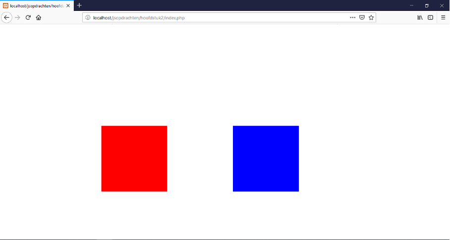
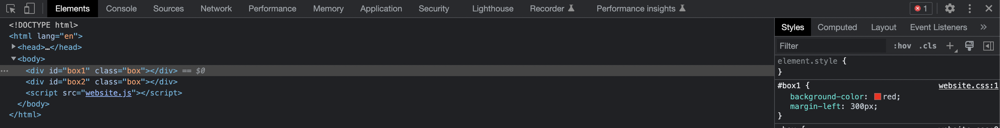
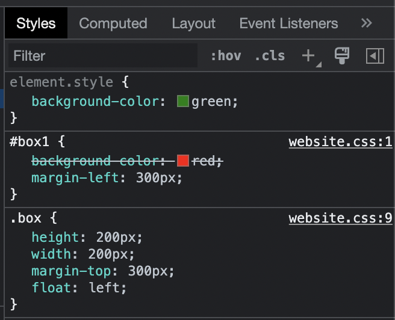
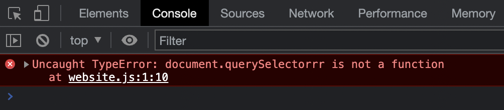

\pagebreak
# JavaScript (JS)
JavaScript is een veel-gebruikte taal om o.a. websites (die je maakt met HTML en CSS) *dynamisch* te maken. Dynamisch betekent dat de website meer kan doen dan alleen maar op je browser-scherm stilstaan (dat is statisch).

Denk bijvoorbeeld aan een refresh-knop, of een foutmelding als je e-mail adres een typfout bevat, of een melding dat je moet opschieten met bestellen want de voorraad is bijna op.

In deze reader ga je leren over **JavaScript**, maar ook **JSON**: JSON is een manier om informatie neer te zetten; een manier dat mensen EN programmeertalen goed kunnen snappen. Dat wordt vaak gebruikt als doorgeef-luik. Bijvoorbeeld:

- JavaScript doet een verzoek aan PHP;
- PHP haalt vervolgens informatie uit de database en geeft dat terug in JSON;
- JavaScript ontvangt dat en kan precies zien welke informatie terug is gegeven;
- Javascript plukt de informatie eruit die het nodig heeft en zet dat neer in de HTML.

## Benodigdheden
- Editor (PHPStorm bijvoorbeeld)
- PHP (XAMPP bijvoorbeeld).
- Browser (Firefox of Chrome bijvoorbeeld).
- Google (Begrijp je iets niet? Dit is je beste vriend!)

## Front-end en Back-end
Dit zijn termen die vaker voor gaan komen, gezien je werkt met HTML/CSS/JavaScript zowel als PHP:
- Front-end is de kant die je ziet: HTML, CSS maar ook Javascript
- Back-end is de kant die je niet ziet: PHP, Java, C# wat draait op een laptop of server.

## Geschiedenis van JavaScript
JavaScript is gemaakt in 10 dagen, in 1995. Laat dat even inzinken. Tien dagen. Door 1 persoon, die destijds werkte voor het bedrijf Netscape (de browser).

JavaScript is initieel ontworpen als script taal in de browser, om zo soepel mogelijk samen te kunnen werken met Java. De naam JavaScript komt daar ook vandaan. Waarom Java specifiek, als het ook werkt met alle andere talen? Heel simpel: Java was destijds een van de populairste programmeertalen, en kon zelfs draaien in browsers als mini-applicaties (*applets*). Op die populariteit kan je dan mooi meeliften.

Tegenwoordig zijn er enorm veel bedrijven en organisaties die meewerken aan het ontwikkelen van JavaScript. De taal veranderd enorm snel en is heel erg flexibel. De laatste jaren is JavaScript zelfs ook populair als *back-end*. Je kan het op dezelfde manier draaien als bijvoorbeeld PHP, Java en C# met behulp van de **V8 engine**, gemaakt door Google.

\pagebreak

# Hoofdstuk 1: Kennis maken met JavaScript
Omdat we JavaScript gaan gebruiken om een webpagina aan te passen, moeten we eerst een webpagina hebben. We gaan een stuk HTML en CSS schrijven en dat vervolgens veranderen met JavaScript.

## 1.1 HTML & CSS
We beginnen door onderstaande pagina te maken:

{ width=50% }

Maak een nieuw project in `PHPStorm` en maak het bestand `index.html` aan met deze inhoud:

```html
<!DOCTYPE html>
<html lang="en">
  <head>
    <meta charset="UTF-8">
    <title>JavaScript hoofdstuk 1</title>
    <link rel="stylesheet" href="website.css">
  </head>
  <body>
    <div id="box1" class="box"></div>
    <div id="box2" class="box"></div>
	<script src="website.js"></script>
  </body>
</html>
```

Er staan twee dozen in de HTML: *box1* en *box2*. Die gaan we mooier maken. Maak `website.css` aan met:

```css
#box1 {
    background-color: red;
    margin-left: 300px;
}
#box2 {
    background-color: blue;
    margin-left: 200px;
}
.box {
    height: 200px;
    width: 200px;
    margin-top: 300px;
    float: left;
}
```

Als je alles goed hebt overgenomen ziet deze pagina er nu exact uit als het voorbeeld hierboven.

\pagebreak

## 1.2 JavaScript
Om ons eerste stukje JavaScript te schrijven maken we gebruik van het JavaScript bestand die in de HTML staat vermeld: 

```html
<script src="website.js"></script>
```

Dat zegt eigenlijk: Laad het script hier in, met de naam `website.js`. Je ziet in het HTML voorbeeld hierboven dat dit script helemaal als laatste (vlak voor de body) wordt ingeladen. De plek waar je dit script inlaad is belangrijk: Tijdens het laden van de hele pagina gaat JavaScript meteen draaien zodra de browser een script tegen komt. Zet je deze dus halverwege de pagina, dan ziet JavaScript maar de helft van de pagina. Zet je het script in de `<head>`, dan heeft het helemaal geen toegang tot de HTML want die is er dan nog niet.

Het script `website.js` gaan we nu aanmaken met de inhoud:

```js
document.querySelector('#box1').style.backgroundColor = "green";
```

Laten we dat even ontleden. JavaScript is een taal waarin je een heleboel aan elkaar kan plakken. Als een functie iets teruggeeft waar functies in zitten, kan je die **meteen uitvoeren**. Dus:

- `document`, daar staat de hele website in, inclusief css, en functies om ermee te werken.
- `.querySelector('#box1')` is een functie in `document` om HTML elementen te selecteren. Wat we dan gaan pakken (of *queryen*) is een `selector` - exact hetzelfde als je in CSS gebruikt. In dit geval het ID `box1`.
- `.style` pakt alle stijlen op het element die we pakken (of *queryen*).
- `.backgroundColor` is specifiek de stijl voor de achtergrondkleur. Die kan je bekijken of aanpassen.
- ` = "green";` maakt de achtergrondkleur groen (net zoals in CSS `#box1 { background-color: "green"; }` dat zou doen). Hier kan je ook *hexadecimale kleuren* zetten, zoals `#00FF00`.

Als je nu de website bekijkt, zie je dat doos nummer 1 groen is geworden. Het werkt!

## 1.3 Developer tools
Fijn dat het nu goed gaat, maar wat moeten we doen als er iets mis gaat? Hoe controleer je dat? *Developer Tools* is je redding. Druk op F12 terwijl je in de browser zit en er verschijnt een balk onderin:

{ width=100% }

Alle HTML van de hele pagina staat aan de linkerkant. Als je iets aanklikt zie je de styling (CSS) staan in het vak helemaal rechts. Daar kan je ook zien welke stijlen worden overgeschreven. In ons geval door JavaScript, en dat ziet er zo uit:

{ width=25% }

Dat kan je lezen als: op het element zelf is een stijl neergezet (door JavaScript). Dat overschrijft de `background-color` stijl die het element krijgt vanaf `#box1` (daar staat ook een streep door). Helemaal rechts staat waar de stijl vandaan komt, in dit geval `website.css` op regel 1.

Alle foutmeldingen van JavaScript komen in de tab `Console`. Als je `console.log("test")` in JavaScript zet, komt dat ook hier terecht (dat is de echo / Console.WriteLine van JavaScript). Als we bijvoorbeeld een typfout hebben gemaakt in onze code, dan zie je dit staan:

{ width=50% }

## 1.4 Opdrachten hoofdstuk 1
Box1 is inmiddels aangepast, probeer nu zelf de kleur van box2 aan te passen naar *oranje* met een *hexadecimale kleurcode*. Gelukt? Voeg dan nog twee divs toe in de HTML en pas daar de kleur van aan met JavaScript.

\pagebreak

# Hoofdstuk 2: Nog meer JavaScript
Laten we nog wat meer aspecten van JavaScript doorlopen

## 2.1 Event listener: on load
Het kan voorkomen dat je JavaScript iets wilt laten doen zodra de pagina voor het eerst verschijnt. Of als je ergens op klikt. Of als je op enter drukt. Al deze voorbeelden (en meer) noem je *events*. Op elk HTML element (en zelfs de hele pagina) kan je aandachtig luisteren tot een specifiek *event* aan de orde is.

Bijvoorbeeld om te kijken of de hele pagina geladen is:
```js
window.addEventListener("load", function () {
    console.log("De pagina is geladen!");
});
```

Als het JavaScript bestand bijvoorbeeld wordt ingeladen in de `<head>` van je HTML document, dan draait het voordat alle HTML werkelijk in de pagina is neergezet. Dan zou je dus een foutmelding krijgen bij het wijzigen van de achtergrondkleur van `#box1`, want die bestaat nog niet. De `console.log` hierboven verschijnt pas als de hele pagina compleet geladen is.

Laten we het ontleden:

- `window` is het browser scherm
- `addEventListener(` is de functie die dan gaat luisteren op `window` voor een specifiek *event*.
- `"load"` is de naam van het *event*. Dus zodra het geladen is.
- `function () {` is een *naamloze functie*, die wordt uitgevoerd door `addEventListener` zodra het klaar is met luisteren. Daarom heb je ook geen naam nodig - de hele functie geef je mee aan de event listener. Een korte versie van een naamloze functie is `() => {`.
- `console.log()` toont een bericht in de *Developer Tools console*.

## 2.2 Event listener: on click
Een ander voorbeeld is iets uitvoeren als je klikt op de `<div>` met ID `box1`:
```js
document.querySelector('#box1').addEventListener('click', function() {
    console.log("Ooooh je mag niet klikken!");
});
```

Laten we het toch weer even ontleden:

- `document`, bevat de hele website, html en css.
- `.querySelector('#box1')` selecteert een HTML element adhv een `selector` - dezelfde manier als CSS. `#box1` is dus het HTML element met ID `box1`.
- `addEventListener(` is de functie die dan gaat luisteren op `#box1` voor een specifiek *event*.
- `"click"` is de naam van het *event*. Dus het klikken op het element.
- `function () {` is een *naamloze functie* die dan wordt uitgevoerd door `addEventListener`.
- `console.log()` toont een bericht in de *Developer Tools console*.

## 2.2 Event listener: on submit
Je kan ook een handeling uitvoeren als je een formulier invult en verstuurd. Dat doe je door op een submit knop te drukken of op enter drukken in een tekst vak, oftewel:
```js
document.querySelector('#search_form').addEventListener('submit', function() {
    console.log("Laten we dan nu het hele formulier naar PHP sturen.");
});
```

## 2.3 Tekst of HTML toevoegen
Je kan meer doen dan alleen de stijl van een HTML element aanpassen. Laten we eens wat tekst, en daarna HTML, toevoegen. Aan `box2` dit keer, `box1` heeft genoeg actie gezien.

Een stuk tekst in de `<div>` met ID `box2` zetten doe je zo:
```js
document.querySelector('#box2').innerText = "Dit is nu de tekst in Box Twee.";
```

Het lijkt heel erg op de stijl-verandering. In plaats van de `style` veranderen we nu de `innerText` variabel, en dat wordt meteen in de HTML doorgevoerd.

Een stuk HTML in `#box2` zetten doe je zo:
```js
document.querySelector('#box2').innerHTML = "<h1>Dit is nu</h1><p>de tekst in Box Twee.</p>";
```

Bijna exact hetzelfde als de tekst veranderen.

## 2.4 Opdrachten hoofdstuk 2
Maak `website.js` zodanig dat:

- `box2` krijgt een stuk tekst met html met een mooie achtergrond kleur als je klikt op `box1`;
- `box1` krijgt hetzelfde maar dan met een mooiere achtergrond kleur, als je klikt op `box2`.
- Beide deze brokken code draaien pas zodra het hele scherm geladen is.

\pagebreak

# Hoofdstuk 3: JSON
Informatie versturen van plek A naar B is misschien wel de meest voorkomende handeling van een programmeur. Een brok software vraagt een ander brok software om informatie, en hoe dat eruit ziet - dát is vaak JSON.

## 3.1 Structuur van JSON
JSON staat voor JavaScript Object Notation. Het is dus hoe JavaScript zelf ook zijn informatie opslaat, voor objecten en arrays.

Stel: Jouw *front-end* (bijvoorbeeld JavaScript) vraagt aan jouw *back-end* (bijvoorbeeld PHP) om informatie van een gebruiker. PHP haalt dat op uit de database (MySQL bijvoorbeeld) en geeft dat resultaat terug. Als je dat PHP bestand bekijkt in de browser zou je dan kunnen zien:

```json
{
    "naam": "Tim",
    "leeftijd": 70,
    "hobbys": [
        "Koffie drinken",
        "Tekenen",
        "Programmeren"
    ],
    "haalt_graag_koffie": false
}
```

Dit is JSON. Het heeft een hele specifieke syntax, een manier van schrijven. Maar ook zonder dat je die regels kent is het vrij goed leesbaar. De regels:

- `{ }` Met **curly brackets** heb je een object. In een object kan je namen met waarden neerzetten (zoals variabelen).
- `"naam": "Tim",` De naam van de "variabel", een dubbele punt en dan de waarde die je erin wilt zetten. Deze velden (of **properties**) eindigen met een komma om aan te geven dat er nog een aankomt, dus het allerlaatste veld heeft deze komma niet.
- `"leeftijd": 70,` Dubbele quotes maakt een string (tekst), en zonder de quotes heb je dan bijvoorbeeld een cijfer, boolean, etc. Dat gaat verder automatisch.
- `[ ]` Met **square brackets** heb je een array. Een lijst van waarden (en alleen de waarden!). Het kan verder alles bevatten. Een lijst van cijfers, een lijst van teksten, etc.

\pagebreak

## 3.2 JSON gebruiken in JavaScript
Als we het in JavaScript willen uitlezen, moeten we eerst bovenstaand JSON object in JavaScript zetten. Met `let` maak je een variabel, dus dan kan je doen:

```js
let gebruiker = {
    "naam": "Tim",
    "leeftijd": 70,
    "hobbys": [
        "Koffie drinken",
        "Tekenen",
        "Programmeren"
    ],
    "haalt_graag_koffie": false
};
```

Dan kan je de verschillende velden direct uitvragen via de naam die je eraan geeft. Deze namen hebben dezelfde regels als variabelen, dus geen spaties en dergelijke. Bij een array (`[ ]`) kan je erdoorheen loopen en daarna de waarden uitvragen. Bijvoorbeeld:

```js
console.log(gebruiker.naam); // Geeft terug: "Tim"

console.log(gebruiker.leeftijd); // Geeft terug: "70"

gebruiker.hobbys.forEach(function (hobby) {
    console.log(hobby); // Elke keer in de loop de volgende hobby
})
```

Maar je kan velden uit een object ook opvragen op de PHP manier:

```js
console.log(gebruiker["naam"]); // Geeft terug: "Tim"

console.log(gebruiker["leeftijd"]); // Geeft terug: "70"
```


## 3.3 Opdrachten hoofdstuk 3
Maak je eigen JSON object zoals het voorbeeld hierboven. Niet met een gebruiker, maar iets anders. Over je hobby of allerdaagse dingen zoals een huis of auto. Lees de waarden uit en zet ze netjes (met html zoals `h1` en `p`) in `box1` en `box2` zodra je op die elementen klikt.

\pagebreak

# Hoofdstuk 4: Fetch data
Een van de grootste krachten van JavaScript is het kunnen ophalen van informatie van een *back-end*. Je stuurt een *request* (verzoek), net zoals bij het bezoeken van een website door middle van een URL, en je krijgt een response (antwoord) terug.


## 4.1 Geen pagina verversen
In het verleden heb je wel eens gewerkt met een formulier (`<form></form>`). Een HTML element dat je om een aantal tekstvelden heen zet en zo gegevens naar een back-end pagina (zoals PHP) kon sturen.

De hele pagina ververst als je een formulier op die manier opstuurt. Het scherm blijft hangen tot je een antwoord (response) krijgt. Terwijl je wacht gaat het PHP script draaien en krijg je een nieuwe pagina te zien met de nieuwe gegevens.

In plaats daarvan kunnen we JavaScript het laten versturen zonder de pagina te verversen. JavaScript stuurt alleen wat in het formulier staat, en krijgt alleen het antwoord daarvoor terug. De hele website blijft verder staan. Het resultaat is een website die minder laadtijd heeft en een stuk vlotter voelt.

Je kan een voorbeeld hiervan vinden op: [http://www.jsexample.ikleverhet.in](http://www.jsexample.ikleverhet.in).


## 4.2 Veiligheid
Voor veiligheidsredenen mag je niet zomaar een back-end (zoals PHP) van een andere website bereiken. Dat noem je CORS, *Cross Origin Resource Sharing*, oftewel het delen van informatie buiten je eigen domeinnaam (dat is in dit geval je *origin*). Elk back-end moet voor zichzelf aangeven of andere websites verzoeken (requests) mogen sturen.

Er zijn wel publieke back-ends (zoals wat je maakt in PHP, oftewel API's) te vinden die specifiek aangeven dat dat mag, gelukkig. Er zijn lijsten te vinden zoals deze:

[https://github.com/public-apis/public-apis](https://github.com/public-apis/public-apis)

Als je wilt testen met een *back-end* zonder er zelf een te maken, kies er dan eentje uit deze lijst die CORS heeft.

## 4.3 Fetch
Om informatie van een back-end op te vragen gebruik je een functie genaamd `fetch()`. Dit zit standaard in de nieuwe versie van JavaScript en is beschikbaar in alle moderne browsers.

Een voorbeeld:
```js
let response = await fetch(url);
```

Als we dat ontleden, zijn dit de stappen die genomen worden:

1. Je roept `fetch(url)` aan met een url erin (bijvoorbeeld `test.php` of `https://google.com/geenidee`);
2. `fetch()` gaat die url opvragen - laten we zeggen dat dat `test.php` is;
3. De webserver op je laptop (Apache, vanuit XAMPP) ontvangt de aanvraag (request), en voert de PHP code van `test.php` uit;
4. Het antwoord (response) is klaar en wordt binnengehaald door `fetch()`.
5. Wat `fetch()` binnenhaalt, in de variabel `response`, is exact hetzelfde als wat je in de browser ziet als je zelf naar de url gaat.


## 4.4 Asynchroon
Informatie opvragen van een back-end duurt natuurlijk even. JavaScript is standaard *asynchroon*, dat betekent dat het niet gaat wachten op een aanvraag die je doet. Zodra de aanvraag voor informatie bij een *back-end* gedaan is, gaat JavaScript meteen verder met de volgende regel code.

### 4.4.1 Promises
De klassieke manier om hier mee om te gaan werkt met een *promise*; een belofte dat het gaat doen wat jij vraagt. Je kan code laten uitvoeren zodra die belofte is gedaan. Dat gebeurt met een `then()` functie die wordt uitgevoerd met de informatie die je wilde ophalen.

Dat ziet er ongeveer zo uit:
```js
fetch(url).then(function(response) {
    console.log("We hebben een antwoord gekregen")
})
```

Laten we dat even ontleden:

1. `fetch(url)` Doe een request naar een url (bijvoorbeeld `test.php`)
2. `.then()` ontvangt 1 parameter, en dat is een functie. Die functie wordt uitgevoerd zodra het response van de url binnen is.
3. `.then( function(response) {} )` Een naamloze functie is dus de parameter, en als die wordt uitgevoerd krijg je de `response` erbij als parameter in dié functie; hetgene wat `fetch()` heeft opgehaald, ofwel de response die de `url` heeft teruggegeven.


### 4.4.2 Await
Een makkelijkere manier is om te wachten tot het klaar is. Het werkt onder water nog steeds met *promises*, maar daar hoef je geen rekening mee te houden. JavaScript stopt met code uitvoeren tot hetgene klaar is waar je op wacht.

Simpelweg gaan wachten op het antwoord kan zo:
```js
let response = await fetch(url);
```

Als we dat ontleden zijn we snel klaar: met het sleutelwoord `await` gaat JavaScript wachten tot `fetch()` (het ophalen van de `url`) klaar is. Dat antwoord wordt meteen in de variabel `response` gezet en dan gaat JavaScript verder.

De functie waar je in wacht (met `await`) moet echter wel aangemeld worden als zijnde *asynchroon*. Dat doe je met het sleutelwoord `async` ervoor, bijvoorbeeld zo:
```js
async function () {
    let response = await fetch(url);
}
```

Een voorbeeld dat een afbeelding ophaalt van een publieke API (*back-end*):
```js
let response = await fetch("https://foodish-api.herokuapp.com/api/");
let data = await response.json();
console.log(data.image);
```

## 4.5 Opdrachten hoofdstuk 4
Als je op `box1` klikt, haal je een afbeelding van een API (zoals in het bovenstaande voorbeeld), en zet je die afbeelding in `box2`.

# Hoofdstuk 5: Eindopdracht JavaScript
Je gaat nu je eigen zoek functie maken. Een webpagina met een invulveld en een zoek-knop. De ingevulde zoektermen worden naar jouw eigen back-end verstuurd (PHP script). In PHP ga je dan zoekresultaten teruggeven.

Hierbij is het de bedoeling dat:

- Je een invoerveld met een knop maakt;
- Je in staat bent om zoektermen naar jouw *back-end* te sturen;
- Dit back-end deze termen opzoekt in een API én een database;
- Dit back-end zijn zoekresultaten teruggeeft in *JSON*;
- Je gebruik maakt van minstens 1 database en 1 API. Spreek van tevoren af met een docent welke API je wil gaan gebruiken. Je mag hiervoor geen Wikipedia gebruiken. Voor ideeën kan je denken aan API's van games, Google, eBay, Amazon, Bol.com, Tweakers, Pokemon, Chuck Norris facts, Star Wars, cat facts, etc.
- De website moet er wel leuk uit zien, vergeet deze niet te stylen!

Je mag ook de code inzien van het voorbeeld, deze is te vinden op:

[https://github.com/koffiebaard/js-reader-eindopdracht](https://github.com/koffiebaard/js-reader-eindopdracht)
