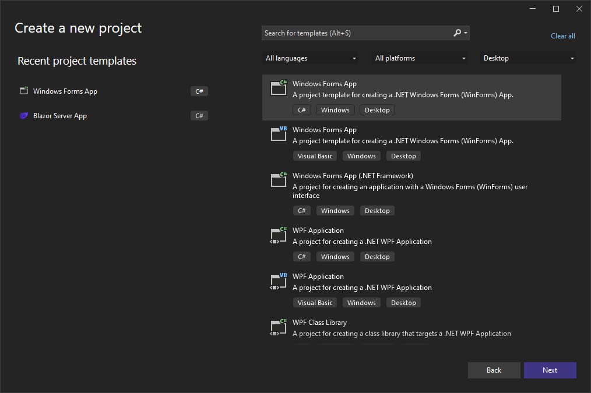
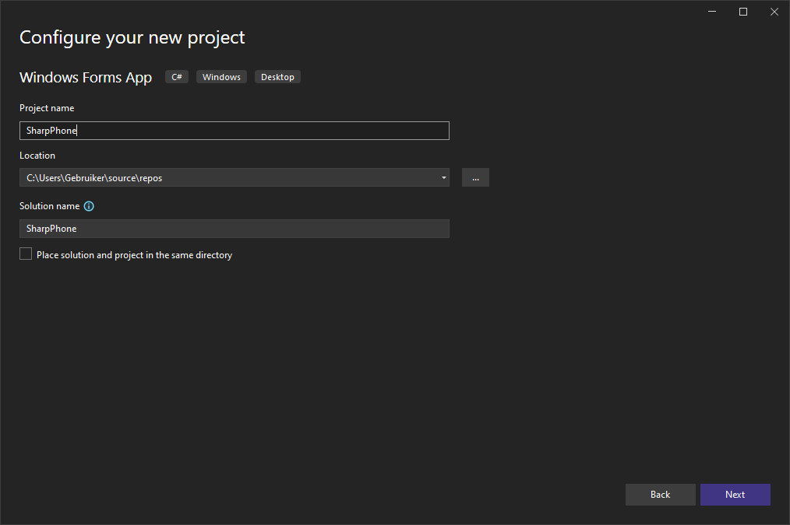
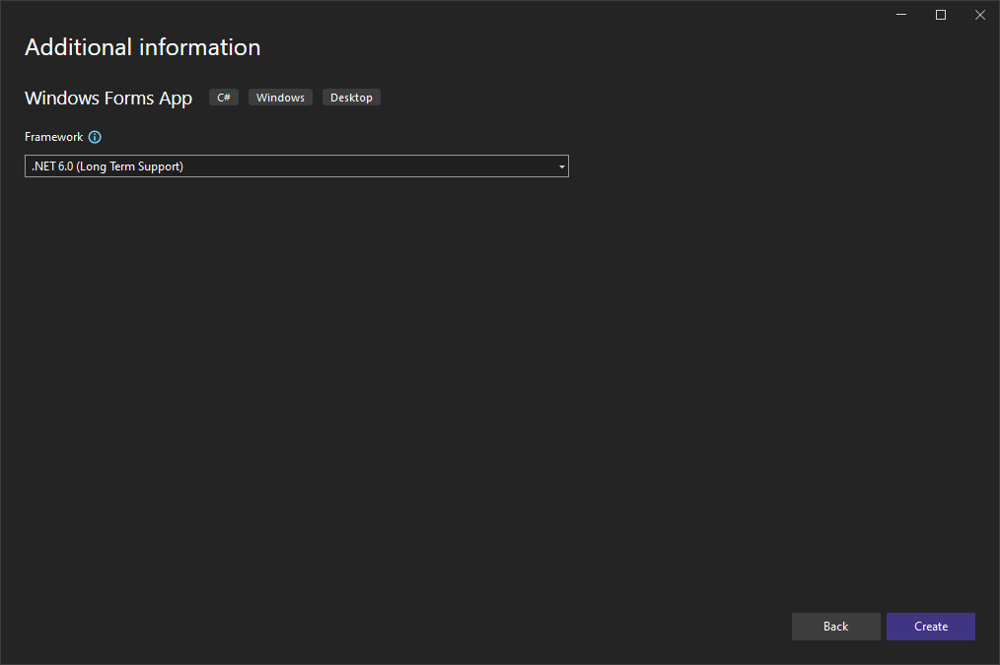
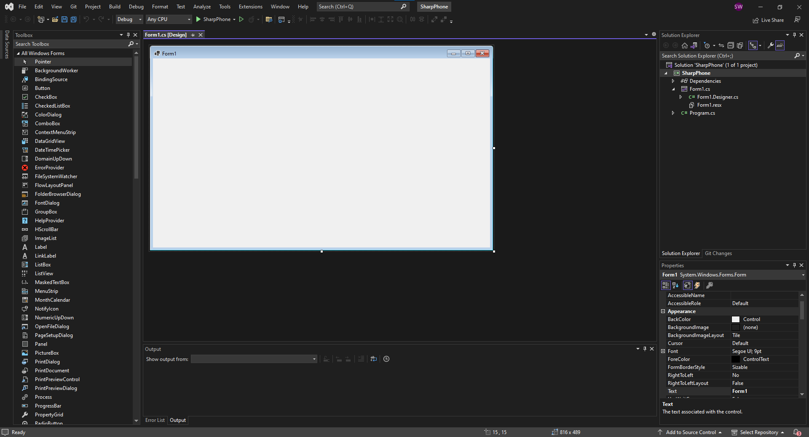
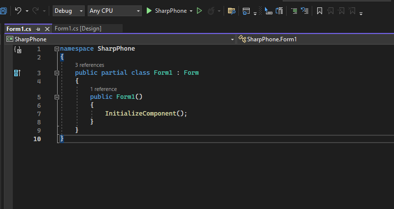
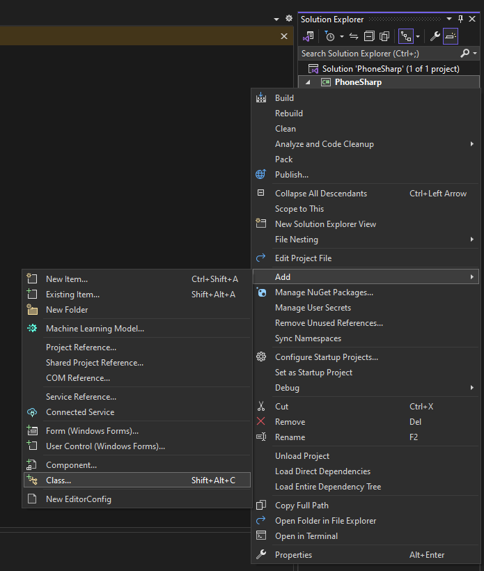
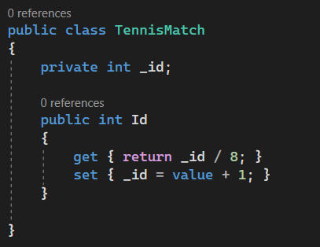
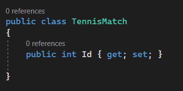
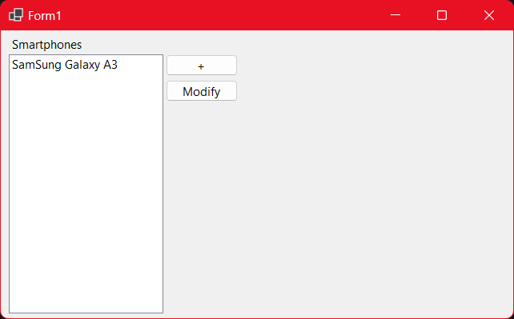
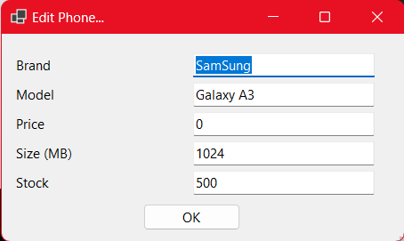

\pagebreak
# EWA
# Programmeren Gevorderd: C\#
In deze reader ga je meer leren over C#, met name hoe je een grafische interface kan bouwen met WinForms. Je gaat een applicatie bouwen voor SharpPhone.

## Introductie SharpPhone
SharpPhone is een middelgrote handelsonderneming die in 1999 is
opgericht door de huidige directrice Melanie Hendrikse. Vanaf het begin
heeft SharpPhone zich gespecialiseerd in de verkoop van kwalitatief
hoogstaande draagbare telefoons. In het beginstadium werden voornamelijk
walkmans, memorecorders, Mp3-spelers en CD-Discmans van gerenommeerde
merken verkocht. De laatste jaren wordt de markt voor draagbare
telefoons gedomineerd door SmartPhones.

Inmiddels bestaat SharpPhone uit 12 medewerkers met een gemiddelde
leeftijd van 36 jaar. Binnen SharpPhone bestaan de afdelingen:
Financiën, Inkoop/Verkoop en Technische support. De dagelijkse gang van
zaken wordt wekelijks besproken in het managementteam dat aangestuurd
wordt door Melanie

*Disclaimer SharpPhone is een fictief bedrijf bedoeld voor educatieve
doeleinden. Genoemde namen zijn tevens fictief. Overeenkomsten met
bestaande bedrijven en personen berusten op louter toeval.*

## Rider
Helaas, helaas, Rider ondersteunt niet de nieuwe WinForms editor die
Visual Studio wel aanbiedt. Het is van belang om wel Visual Studio te
downloaden. Instructies voor het installeren van Visual Studio kan je
terug vinden in het Opdrachten document voor C# (Programmeren basis).

Het gebruik van Visual Studio is deze keer verplicht.

## Document revisies

| DATUM       | VERSIE      | OMSCHRIJVING                          |
|-------------|-------------|---------------------------------------|
| 6-4-2023    | 1.0         | Initieel document                     |
| 31-8-2023   | 1.1         | Aanpassingen formaat.                 |
| 11-9-2023   | 1.2         | Verwijderen referentie naar Rider IDE |
| 12-10-2023  | 1.3         | Migratie naar readers repository      |

\pagebreak

# Project aanmaken
Let op, voor deze opdracht heb je Visual Studio (Community) nodig. Dit
document zal voornamelijk ingaan op Visual Studio.

{ width=6in }

Open de Visual Studio Launcher en maak een nieuw project aan van het type
”Windows Forms App”.

{width=6in }

Geef je project een goede naam, bijvoorbeeld SharpPhone.

{ width=6in }

Selecteer .NET 6.0 als Framework.

## WinForms Editor

Windows Forms, ook wel bekend als WinForms, is een applicatie type die
native werkt op Windows. De gebruiksinteractie wordt aangestuurd door
een GUI die het form opbouwt door middel van labels, buttons, textboxes
en meer.

Een Form bestaat uit een aantal onderdelen. Een visuele Form editor, een
resource bestand en de een class-bestand waar we alle code in schrijven.
Het resource bestand kan je voor nu negeren.

\pagebreak

# Hoofdscherm opzetten
{ width=7.17639in }

Op het hoofdscherm zullen we voorraden bekijken en beheren. Maar eerst gaan we deze grafisch form
geven.

1.  Mocht het nog niet zo zijn, open het Form1 bestand. (Deze staat in
    de Solution Explorer aan de rechterkant).

2.  Mocht het nog niet zo zijn, open de Toolbox en pin deze vast.

    1.  View -\> Toolbox

3.  Zoek een Label control, en plaats deze boven in de hoek.

    1.  Druk op F4, dan zie je de Eigenschappen (Properties) van het
        label.

    2.  Zoek naar de Property “Text”, en vul hier de waarde “Voorraad”
        in.

4.  Zoek naar de List control, en sleep deze op het Form. Zet deze
    linksboven in de hoek.

    1.  In de Properties, zoek naar “(name)”, en vul hier “listPhones”
        in.

    2.  Vergroot de hoogte van het list control zodat deze lang genoeg
        is om de hele hoogte van het form te bezetten.

5.  Zoek naar de Button control, en plaats deze naast de list.

    1.  Verander de tekst naar een “+” teken.

    2.  Verander de naam naar “btnAddPhone”.

6.  Voeg nog een button control toe.

    1.  Verander de tekst naar “Aanpassen”.

    2.  Verander de naam naar “btnModify”.

Voor nu zijn we klaar met het opmaken van het formulier.

## Benamingen voor Form Controls

Er is een reden dat we de naam van de van de gebruikte controls
aanpassen, is heel simpel.  
Elke keer dat je een control op een WinForms sleept, genereerd Visual
Studio (en Rider) een standaard naam, bijvoorbeeld : label1, label2,
label3, form1, textbox1, textbox2, etc.  
We geven controls een eigen naam zodat we ze makkelijker kunnen
terugvinden en zodat we snel kunnen zien waar ze voor gebruikt worden.

## Code editor

Met F7 en SHIFT + F7 (Visual Studio) kan je wisselen tussen de WinForms
editor en de code editor. Je ziet al dat hier wat “boilerplate”
(voorgeschreven) code staat.

Een WinForms is grafisch veel complexer dan een Console applicatie waar je
tot nu toe mee gewerkt hebt. De constructor roept 1 methode aan,
Initialize ();  
Deze methode verteld aan Windows hoe het scherm er op technische wijze
uit komt te zien. Het is verplicht om deze methode aan te roepen om een
WinForms op het scherm te tekenen.

## Events en Callbacks

Om het programma te laten reageren op input, maken wij gebruik van
Events. Events, het zegt het al, zijn “gebeurtenissen”. Een Event gaat
samen met een methode met een aantal specifieke parameters en gaat af
wanneer de gebruiker een Event afvuurt. Het afvuren van een Event, wordt
ook wel eens ‘Invoking’ genoemd.

Verderop in dit document gaan we gebruik maken van event.

\pagebreak

# Data inrichten

We zijn nu klaar om de data in te richten voor onze app.

1.  Maak nu een nieuwe class genaamd “SmartPhone” aan in een nieuw
    bestand en voeg de volgende properties toe. In de "Solution Explorer", rechtermuisknop op je Project (groen icoon) -> Add -> Class...

    1.  Id : Uniek nummer van de smartphone

    2.  Brand: Merk van de smartphone

    3.  Model: Model van de smartphone

    4.  StorageSizeMb: De opslagruimte op de smartphone in MB’s

    5.  Price: De prijs van de smartphone

2.  In de SmartPhone class, maak een methode die een Smartphone aanmaakt
    en returned (oftewel een Constructor).

Terug in Form1.cs (de code editor) gaan we in het List control een
lijstje van smartphones weergeven.

1.  Voeg een Property aan Form1.cs toe van het type List\<*T*\>. De
    List\<*T*\> staat in de assembly *System.Collection.Generic.*

    1.  De \<*T*\> is het type van de objecten die in het lijstje komen.
        Dit is de Smartphone class.

2.  In de constructor, onder het aanroepen van Initialize();:

    1.  Initialiseer het List\<T\> object en vul 1 smartphone in.

        1.  Id : 0

        2.  Brand : SamSang

        3.  Model : Blackhole E55

        4.  Size : 128000

        5.  Price : 128,92

3.  Daarna gaan we het List control aanroepen en gaan we het Merk en
    Model van de smartphone weergeven.

    1.  Roep de variable van *listPhones* aan en volgt dit op met
        ‘.Items.Add()’. Hier moeten we een string opgeven.

    2.  Haal het eerste item van de List\<Phone\> op en zet Merk en
        Model in een string. Wijs deze string toe aan de
        Items.Add(string) methode.  
        *Tip: String Interpolation*

*Start voor de grap het project. Dan zie je vervolgens een mooie
grafische interface met 1 smartphone in de lijst.*

\pagebreak

## Properties en Fields

In C# Basis is dit onderwerp ook al behandeld, maar er is meer dan
alleen maar “het bestaat”. Properties zijn eigenschappen die iets
vertellen over het object waar zij bij horen. Een Field aan de andere
kant is een verborgen stukje data waarop je handelingen kan uitvoeren.

In oudere applicaties zal je zien dat een Property doorverwijst naar een
Field, soms ook wel een Backing-Field genoemd.

{ width=3.39196in }

In bovenstaand voorbeeld hebben we een public Property “Id” en een
private Backing-Field “\_id”. De underscore word vaak gebruikt om public
en private elementen van elkaar te scheiden. Een ‘\_’ staat voor private
en een hoofdletter aan het begin van een naam betekend Public.

In een Property kunnen we mutaties uitvoeren op zowel get als set, in
tegenstelling tot een Field, waarop deze mutaties niet zouden kunnen.

Een Property met een Backing-Field wordt ook wel een FullProperty
genoemd. Als je geen mutaties hoeft te doen op de Backing-Field, kan je
gebruik maken van een AutoProperty.

{ width=3.15027in }

Hoewel de Field er nu niet meer bij staat, bestaat deze onder water wel
maar nu communiceer je direct met de Property.

In het algemeen roep je niet direct de Field aan.

\pagebreak

## Toevoegen van nieuwe Smartphones

Het toevoegen van een nieuwe smartphone gaan we doen aan de hand van een
nieuw Form. Dit form zal invulvelden bevatten en 2 buttons, OK en
Cancel.

1.  Voeg een nieuw Forms bestand toe en noem deze “formAddPhone”.

2.  Voeg de volgende controls toe op het form.  
    De Labels staan onder elkaar en de Textboxen staat onder elkaar.

    1.  Een Label met de tekst “Merk”.

        1.  Daarnaast een Textbox, met de naam “txtBrand”.

    2.  Een label met de tekst “Model”.

        1.  Daarnaast een Textbox met de naam “txtModel”.

    3.  Een label met de tekst “Size”.

        1.  Daarnaast een Textbox met de naam “txtSize”.

    4.  Een label met de tekst “Prijs”.

        1.  Daarnaast een Textbox met de naam “txtPrice”.

    5.  In de linkeronderhoek, een Button met de tekst “Cancel”.

        1.  Verander de naam van de button naar “btnCancel”

    6.  In de rechteronderhoek, een Button met de tekst “Ok”.

        1.  Verander de naam van de button naar “btnOk”.

*Voel je vrij om de grote van het Form aan te passen. Let wel op dat je
alle controls wel mee verplaatst.*

Dubbelklik op de OK knop. Je krijgt nu een stukje code genaamd
“btnOk_OnClick” met de parameters van *object sender* en *EventArgs e*.
Dit is een voorbeeld van een event callback.

1.  In de formAddPhone.cs, voeg een property toe van het type Phone.
    Deze representeert een nieuwe smartphone.

2.  In de callback methode (btnOk_OnClick), voeg validatie toe voor de
    verschillende textboxen die je hebt toegevoegd.

    1.  Om ingevulde waardes uit een Textbox te krijgen, roep je de naam
        van een textbox aan, bijvoorbeeld “txtModel”, en vraag je de
        Text property uit, “txtModel.Text”.  
        Properties zijn eigenschappen over een object, geven bijna
        altijd een resultaat terug. In dit geval een string.

    2.  Instantieer een nieuw Phone object, en vul alle properties met
        de ingevulde Text van de Textboxen. Vergeet niet om validatie te
        doen op input door middel van “Parse”.  
        **Id hoef je niet in te vullen!**

    3.  Wijs het nieuwe phone object toe aan de Phone property die je
        boven in de class eerder hebt gemaakt.

    4.  Op het Form, zit een verborgen enum property genaamd
        “DialogResult”. Zet deze op DialogResult.OK en roep daarna
        “*Close();*” aan om het Form te sluiten*.*

3.  Dubbelklik nu op *btnCancel*, zet de property voor DialogResult op
    DialogResult.Cancel en roep in de callback “*Close();*” aan.

\pagebreak

Nu gaan we terug naar Form1 (WinForms Designer).

1.  Dubbel klik daar op de button “*btnAddPhone*” en maak een callback
    voor *btnAddPhone_OnClick*.

2.  In de callback, maak een variable van het type *FormAddPhone* en
    initialize deze.

3.  Van de variable, roep de methode *ShowDialog()* aan.

    1.  Dit betekend dat Form1 niet langer input accepteert zolang het
        formAddPhone open staat.

4.  De methode *ShowDialog* geeft een enum (DialogResult) resultaat
    terug. Controleer met een *if* statement of het DialogResult OK was.

    1.  Als het resultaat OK was:

        1.  Haal uit de variable van de *formAddPhone* de *Phone*
            property op en update het Id naar het eerst volgende nummer
            die in de lijst kan.  
            *Tel de items in de lijst, en voeg er 1 toe*.

        2.  Creeër een nieuwe methode die de Listbox op het scherm
            leeghaald en vult met de Merk en Model van alle telefoons in
            de Phones list. Roep deze meteen aan.  
            *Gebruik de listPhones.Items.Clear() methode.*

    2.  Als het resultaat niet OK was hoeft er niks te gebeuren.

Probeer het programma nu op te starten en een aantal telefoons toe te
voegen aan de lijst.

\pagebreak

# Uitbreiding

We hebben nu een WinForms applicatie met wat basis functionaliteit. Maar
we zijn er nog niet, we gaan nu het een en ander uitbreiden. Vanaf dit
punt zul je wat minder hulp krijgen. De basis van C#, de loops, if –
else, while, for, foreach en etc, blijven allemaal hetzelfde. WinForms
blijft lastig, kijk op het internet of vraag een docent om hulp als je
vast komt te zitten.

## Voorraad beheer

Naast het toevoegen van nieuwe telefoon, moeten we ook gaan bijhouden
hoeveel we van elke telefoon op voorraad hebben en we moeten in staat
zijn om de voorraden te muteren. We gaan hiervoor geen compleet nieuwe
Form bouwen, maar de bestaande FormAddPhone hergebruiken.

1.  Breid de SmartPhone class uit zodat we ook de voorraad van een
    telefoon kunnen bijhouden.

2.  In het FormAddPhone, plaats een nieuwe Label en Textbox om de
    voorraad in op te geven. Pas de btnOk_OnClick callback methode aan
    zodat deze nieuwe informatie ook word ingevuld in het SmartPhone
    object.

3.  Voeg een overload voor de FormAddPhone waar een SmartPhone object
    kan worden meegegeven. Wijs de smartphone parameter toe aan de
    SmartPhone property en vul alle textboxen in met de informatie uit
    de SmartPhone property. **Vergeet niet om als aller eerste de
    methode InitializeComponent(); aan te roepen!**  
    *Gebruik de Text property van de textboxen.*

4.  Bonus: Kijk of het je lukt om in de nieuwe contructor de tekst van
    het Form te veranderen naar “Edit phone…”.

## Aanpassen van bestaande SmartPhones

In het gedeelte van “Voorraad beheer”, heb je al het grondwerk gelegd
voor het aanpassen van bestaande SmartPhones. Hiervoor gaan we hetzelfde
FormAddPhone hergebruiken.

1.  In de btnOk_OnClick callback methode, voeg een controle toe die
    kijkt of de SmartPhone property geïnitialiseerd (initialized) is.  
    *TIP: een un-initialized object heeft altijd de waarde ‘null’ (maar
    dan zonder quotes).*

2.  Als de SmartPhone property null is:

    1.  Initialize de SmartPhone property, en vul alle beschikbare data
        in.

3.  Als de SmartPhone property niet null is:

    1.  Sla de initialization over en vul alle beschikbare data in.

4.  De toewijzing van DialogResult.OK en het aanroepen van Close()
    moeten altijd gebeuren.

<!-- -->

1.  Ga terug naar Form1. Maak nu een callback methode voor de button
    btnModify.

2.  Maak een variable om de geselecteerde index van de Listbox
    listPhones op te slaan.

3.  Gebruik de index variable om de juiste Smartphone op te halen uit de
    List\<SmartPhone\>.  
    *TIP: Het ID van de SmartPhone en de Index van de Listbox zijn
    gelijk aan elkaar.*

4.  Maak een nieuwe variable van het type FormAddPhone en geef de
    SmartPhone door als parameter. Laat dan FormAddPhone als Dialog en
    sla het DialogResult op in een nieuwe variable.

\pagebreak

5.  Maak nu weer de controle op DialogResult.OK.

    1.  Als het resultaat Dialog.Ok is:

        1.  Haal de SmartPhone property op uit de FormAddPhone variable.

        2.  Gebruik het ID van de aangepast SmartPhone om de bestaande
            smartphone in de List\<SmartPhone\> te overschrijven.  
            *TIP: De Index is gelijk aan het ID van de
            List\<SmartPhone\>.*

        3.  Ververs de ListBox met de functie die je eerder hebt
            gemaakt.

## Inloggen

We willen niet dat ieder persoon zomaar in het voorraad systeem kan
kijken. Voordat we het hoofdscherm laten zien, moet een gebruiker
inloggen met een gebruikersnaam en wachtwoord.

1.  Maak een nieuw Form aan met de naam “FormLogin”.

2.  Plaats de juiste controls op het Form zodat je een gebruiksnaam en
    wachtwoord kan invoeren.

    1.  Voeg een extra label toe en geef deze een goede text die
        aangeeft dat de inloggegevens incorrect waren.

    2.  Je mag zelf een wachtwoord bepalen.

3.  Als je 3x een verkeerd wachtwoord invoert, moet je het programma
    sluiten.

4.  Als je het juiste wachtwoord invoert, ga je verder naar het
    hoofdscherm.

\pagebreak

# Einde

Eindelijk, je bent zo goed als klaar. Alleen dit laatste irritante
verhaaltje nog even.

Aan het einde van de rit heb je iets wat lijkt op onderstaande
screenshots. Het hoeft niet 1 op 1 op elkaar te lijken, zolang dezelfde
elementen wel aanwezig zijn.  
*(Dacht je nou echt dat ik code ging delen? )*

WinForms is een goed idee om relatief snel een prototype of idee in
elkaar te zetten en te testen. In de industrie zie je WinForms vooral
gebruikt worden in plaatsen waar een stabiele internetverbinding niet
altijd haalbaar is of voor specialismes waar web development niet altijd
handig is.
