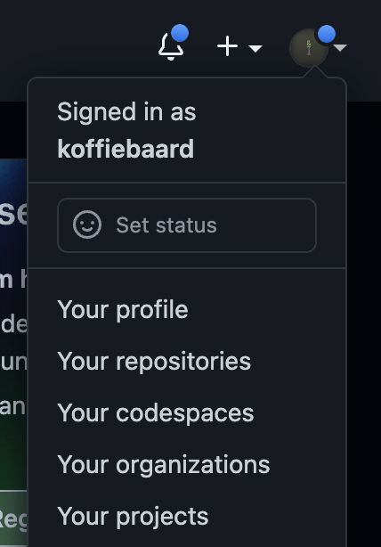
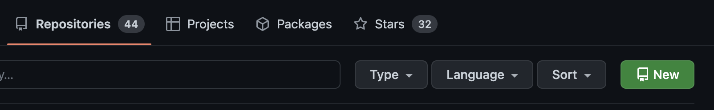

\pagebreak
# Versie beheer
Zodra je een tijd bezig bent met programmeren, kan het zijn dat je iets meer wensen hebt voor het opslaan van je code.

Misschien heb je eindelijk je code werkend, maar wil je iets anders proberen? Als je nieuwe poging niet handig blijkt, zal het heel moeilijk worden om terug te gaan naar je oude werkende versie.

Misschien wil je op je laptop werken, maar ook thuis op je desktop.

Misschien wil je samenwerken met andere mensen. Hoe krijg je jouw code op hun laptop, en andersom?

Daar hebben we versie beheer voor. Daarmee kan je:

- Meerdere veranderingen in bestanden allemaal in 1x opslaan met een omschrijving
- Terug naar de vorige versie van elk bestand die je zelf kiest
- Met meerdere computers/mensen werken aan hetzelfde project
- Het hele project zorgeloos stuk maken, zonder gevolgen


# Git
Om dat allemaal voor je te regelen, heb je software nodig. Git is de populairste applicatie voor versie beheer. Je installeert het op je laptop (of via je code editor) en je kan het meteen gebruiken. Git kan alles wat hierboven vermeld is, en nog veel (veel) meer.

Stap 1 is dus Git installeren.

### Git installeren op Windows
Installeer het via de Git download pagina voor Windows:

[https://git-scm.com/download/win](https://git-scm.com/download/win)


### Git installeren op Mac OS
Installeer Git met `Homebrew`:

```{.bash .number-lines}
brew install git
```


### Git installeren op Debian-based distro's
Apt (en alle andere package managers) hebben git erin staan:

```{.bash .number-lines}
sudo apt install git-all
```

\pagebreak

# Opdrachten Git
Je gaat een Git repository aanmaken en zet daar een bestand in met verschillende veranderingen. Dan gaan we kijken hoe Git je kan helpen met het opslaan van je code.


## Repository
Een repository is een opslagplaats. In een repository stop je doorgaans één project - denk b.v. aan alle Java opdrachten, of een repository voor al je HTML opdrachten.

De repository maak je aan in een map (directory), en alles wat daarin staat (ook alle andere mappen!) horen bij het domein van Git.

### Opdracht 1: Maak een repository
Maak van een bestaande map een Git repository (dat noem je initialiseren):

Maak een nieuw project in je code editor (het maakt niet uit wat voor project).

Open de terminal (alt+F12 / option+F12) en typ in:

```{.bash .number-lines}
git init
```

Nu heb je een Git repository aangemaakt. Alles in deze map (alle bestanden én mappen) vallen nu onder de repository.

Maar hoe werkt dat? Git heeft zijn eigen informatie, zoals welke branches er zijn, op welke branch zit je nu, en wat zijn alle opgeslagen veranderingen tot nu toe. Dat moet ergens opgeslagen worden, en dat doet het in een `.git` map. De punt (.) voor de naam zorgt ervoor dat het doorgaans verborgen is.

Dat ziet er zo uit:

{ width=50% }

\pagebreak

## Branch
In een repository wordt alle code opgeslagen in een `branch`. Vrij vertaald is het een `tak`, en dat is verrassend accuraat. Standaard werk je in de main branch (een `branch` genaamd `main`). Daarin wordt al je code opgeslagen. Deze wordt standaard voor je aangemaakt als je een repository aanmaakt.

Waarom in een branch? Om makkelijker te kunnen werken. Als je alles in je project wilt aanpassen kan je ervoor kiezen om een nieuwe branch maken. Dat is een aftakking, een kopie van de `main` branch. Zodra alles werkt kan alle gemaakte veranderingen terug sturen (oftewel `mergen`) naar de `main` branch. Gaat het niet goed met je veranderingen, en is alles kapot, dan is de `main` branch nog intact en hoef je niets te repareren.

### Opdracht 2: Kijk op welke branch je nu zit

Bekijk de status van Git. Je ziet op de bovenste regel op welke branch je nu zit:
```{.bash .number-lines}
git status
```

## Commit
In een branch sla je dus alle code op. Zodra je iets werkend hebt op je laptop, waar je blij mee bent, kan je je wijzigingen in 1x opslaan in Git. Alle wijzigingen in welk bestand dan ook, zolang ze in dezelfde git map staan. Dat doe je met een `commit`. 

Een commit is dus alle wijzigingen vanaf de vorige opgeslagen versie van de code. Daarbij kan je een naam en een omschrijving toevoegen. Zo kan je makkelijk de vorige versies van code terug vinden.

Al je bestanden zijn dan eigenlijk niets meer dan een lijst van commits; een serie van wijzigingen op wijzigingen op wijzigingen. Zo kan je heel flexibel terug springen naar de vorige versie van je code, in welk bestand dan ook, en raak je nooit meer iets kwijt.

### Opdracht 3: Maak een commit
Maak een bestand aan (in de repository), en zet daar wat code of tekst in. Dat kan van alles zijn, als voorbeeld hou ik `test-bestand.php` aan.

Bekijk de status van de repository met:

```{.bash .number-lines}
git status
```

Als je dat in de terminal typt ziet het resultaat er ongeveer zo uit:

```{.bash .number-lines}
On branch main

Untracked files:
  (use "git add <file>..." to include in what will be committed)
        test-bestand.php
```

Zoals je ziet is het bestand `untracked`, oftewel het is nog niet aan Git toegevoegd. Git weet dus nog niet dat het bestand bestaat.

Voeg je bestand aan Git toe:

```{.bash .number-lines}
git add test-bestand.php
```

Als je nu `git status` doet, zie je heel wat anders:
```{.bash .number-lines}
On branch main

No commits yet

Changes to be committed:
  (use "git rm --cached <file>..." to unstage)
	new file:   test-bestand.php
```

Git ziet een nieuw bestand genaamd `test-bestand.php`, klaar om ge-commit te worden. Een `commit` is 1 of meer veranderingen in je code die je in Git wilt opslaan. Dat kan één bestand zijn of veertig, dat maakt niet uit. De commit kan je een naam geven om makkelijk de geschiedenis van je code terug te kunnen zien.

Maak een commit en zet er een mooie naam bij, in de quotes (`"`) achter `-m`:

```{.bash .number-lines}
git commit -m "Dit is een mooi bericht voor bij mijn commit"
```

Het bestand is nu ge-commit. Wat je ook doet met het bestand vanaf hier, of je het nou verwijderd of aanpast, je kan altijd teruggaan naar het bestand zoals het er nu staat. Als je nu `git status` doet zal het zeggen dat er niets te doen is.

### Opdracht 4: Maak nóg een commit
Verander de tekst in het bestand dat je hebt aangemaakt. Nu kan je de veranderingen weer toevoegen met `git add` en een nieuwe commit ervan maken:

```{.bash .number-lines}
git add test-bestand.php
git commit -m "Nu is het bestand NOG mooier"
```

### Opdracht 5: Bekijk de gemaakte commits
Je kan alle commits in een repository terugzien door dit in je terminal te typen:

```{.bash .number-lines}
git log
```

Dan ziet het er ongeveer zo uit:

```{.bash .number-lines}
commit 575b6f762bb6b108dee6b1569297098460f4662b (HEAD -> main)
Author: Tim Quax <t.quax@novacollege.nl>
Date:   Thu Sep 15 17:55:33 2022 +0200

    nu is het bestand NOG mooier

commit 1479d14e28ea6b67585a7319b87e5026ec7ab3f3
Author: Tim Quax <t.quax@novacollege.nl>
Date:   Thu Sep 15 17:50:47 2022 +0200

    Dit is een mooi bericht voor bij mijn commit
```

Het meeste spreekt voor zich, de auteur en datum en het bericht die we bij de commit hebben gezet. Maar er staat ook een lang brok tekst bij `commit`. Dat is de `commit ID`, en die zal je nodig hebben als je terug moet zoeken in de geschiedenis van je code.

### Opdracht 6: Ga terug naar de oude versie
Laten we tijdelijk even teruggaan in de tijd, om te kijken naar de vorige versie van het bestand. Dat doen we door een specifieke commit uit te checken. Pak daarvoor de `commit ID` van de onderste commit in de lijst hierboven (van `git log`).

Als voorbeeld heb ik hieronder de `commit ID` van mijn eigen Git repository:

```{.bash .number-lines}
git checkout 1479d14e28ea6b67585a7319b87e5026ec7ab3f3
```

Kijk nu naar je bestand. Het is nu de vorige versie.


### Opdracht 7: Spring weer naar de nieuwste versie
Je kan kijken hoe het hele project er toen uit zag, maar gelukkig kan je ook weer terug. Er is niets veranderd in je branch - het is echt een kijkje in het verleden wat je gedaan hebt. Terug naar de nieuwe versie van je bestand doe je door de branch `main` uit te checken. Dan krijg je de nieuwste bestanden die daarin zijn ge-commit.

Naar een branch wisselen, of naar de nieuwste versie van je huidige branch, doe je zo:

```{.bash .number-lines}
git checkout main
```

Het doet dezelfde checkout als je deed met de `commit ID`, maar dan met de naam van je branch. In dit geval is dat `main`, de standaard branch.

\pagebreak

# GitHub
GitHub is het social media platform voor programmeurs. Je hebt een profiel, kan andere programmeurs volgen en je hebt zelfs een timeline.

Maar GitHub gaat ook om _samenwerken_. Je mag daar gratis je Git repositories opslaan. Die kan je publiek toegankelijk maken en dan staan ze op je profiel, maar je kan ze ook privé aanmaken en dan kies je zelf wie ze mag zien.

## Account
Een account op GitHub is hetzelfde als elk ander social media platform. Je account is publiek, maar wat er op komt te staan en wat er zichtbaar is, is geheel aan jou.

### Opdracht 1: Maak een account op GitHub
Ga naar [GitHub.com](https://github.com/) en maak een account aan. Heb je er al een, dan kan je daarop inloggen.


## Repository op GitHub
Je kan je Git repository van je laptop naar GitHub sturen. Je kan ook de laatste wijzigingen van GitHub's repository binnenhalen op je laptop. Zo kan je dus heel makkelijk samenwerken met anderen.

Je kan het ook gebruiken simpelweg als backup; als je laptop sterft heeft GitHub al je code en opdrachten nog. Als je soms werkt op een computer thuis, en soms op je laptop, is het een mooie manier om te zorgen dat ze altijd de up-to-date code hebben. Je kan zelfs al je notities of instellingen van JetBrains in een repository stoppen.

### Opdracht 2: Maak een lege repository aan
Ga naar de repositories pagina op GitHub. Daar kan je een nieuwe repository aanmaken.

{ width=30% }

{ width=50% }

Een paar details voor het aanmaken:

- Verzin een mooie naam.
- Zet het op `public` (iedereen op het internet kan het zien) of `private` (alleen jij kan het zien).
- Verander niets aan de instellingen eronder (over README files e.d.)

## Verbind de twee repositories
Zodra je repository is aangemaakt krijg je een hele lijst met mogelijke commands om te doen. We hebben al een repository, dus we concentreren nu op het koppelen van de repository op je laptop met de repository op GitHub. De repository op je laptop noem je de lokale repository. De repository op GitHub noem je een `remote` repository.

Samen worden ze een geheel. De commits (en branches) die je aanmaakt op je laptop stuur je naar GitHub via `git push`. Als je commits (en branches) van andere mensen wilt binnenhalen, doe je een `git pull`.

### Opdracht 3: Zet je repository op GitHub
Bij het kopje "bestaande repository aan GitHub toevoegen" staat een lijst van drie commands. Die moet je gaan uitvoeren.

De drie commands zijn deze:

Stel de `remote` in op je repository:
```{.bash .number-lines}
git remote add origin <url van de GitHub repository>
```

Verhuis de hoofd-branch naar `main` (dat hoeft niet, want dat is het al):
```{.bash .number-lines}
git branch -M main
```

Stuur alle commits in de `main` branch naar de repository op GitHub:
```{.bash .number-lines}
git push -u origin main
```

Als je nu de GitHub pagina ververst zie je jouw bestand staan. Als je erop klikt zie je de inhoud van het bestand.

## Eind opdracht
Nu komt al je vergaarde kennis samen:

- Verander de tekst (weer) in het bestand
- Maak een commit
- Stuur de commit naar GitHub
- Kijk op GitHub bij de repository, en zie de verandering.

\pagebreak

# Samenwerken (bonus opdracht)
Samenwerken met andere mensen in 1 project kan lastig zijn. Het wordt dan heel belangrijk om te weten hoe Git je daarbij kan helpen. Als iedereen tegelijkertijd in hetzelfde bestand gaat werken, en continu wijzigingen pushed naar GitHub, wordt het heel gauw heel vervelend.

## Feature branch
Als je gaat samenwerken op 1 project werkt iedereen in een __kopie__ van de code. Oftewel je eigen branch; een aftakking van de `main` branch. Je maakt een branch met 1 doel, een niet al te grote taak die je binnen een dag (of enkele dagen) af kan krijgen. De branch geef je een naam die goed omschrijft wat je als doel hebt. Je kan bijvoorbeeld een branch maken om de Git samenwerk-opdrachten aan toe te voegen en die branch noem je dan `opdracht-samenwerken`.

Zo'n branch noem je een `feature branch`. 

Als je klaar bent, en alles werkt, ga je jouw aanpassingen weer samenvoegen in de `main` branch en de feature branch (`opdracht-samenwerken`) wordt verwijderd. De aftakking gaat dus weer terug naar waar hij vandaan kwam.

TODO: afbeelding van branch aftakken / mergen

### Opdracht 1: Maak een feature branch
Maak een branch aan. Na de `-b` staat de branch naam in quotes (`"`), daar kan je een mooie naam neerzetten. Let erop dat je geen spaties gebruikt:
```{.bash .number-lines}
git checkout -b "opdracht-samenwerken"
```

### Opdracht 2: Maak een commit en push
Verander het testbestand opnieuw en maak er een commit van.

Nu hebben we een hele nieuwe branch aangemaakt, met een commit erin, maar GitHub's repository heeft de hele branch nog niet. Daarom gaat de allereerste push iets anders - om aan te geven dat deze branch aangemaakt moet worden. Zet daar dus dezelfde branch naam in:
```{.bash .number-lines}
git push -u origin "opdracht-samenwerken"
```

Alle verdere commits kan je gewoon met `git push` doen.

\pagebreak

### Opdracht 3: Spring heen en weer
Met `git checkout` wissel je van branch. Met `-b "branch-naam"` erachter maak je meteen ook een branch aan, zoals je gedaan hebt in opdracht 1. Zonder de `-b` kan je dus heen en weer springen tussen branches, zonder dat er iets gebeurt of veranderd.

Ga naar de `main` branch:
```{.bash .number-lines}
git checkout main
```

En bekijk je testbestand. Het is nu de vorige versie.

Ga nu weer terug naar je eigen branch:
```{.bash .number-lines}
git checkout opdracht-samenwerken
```

En je wijzigingen in het testbestand staan er weer.


## Pull request (of merge request)
Het is niet altijd even handig om iedereen in een project zomaar alle code aan te laten passen. Voordat iemands code in de `main` branch wordt samengevoegd kan je alle veranderingen laten controleren door andere projectleden. Dat noem je een __Pull Request__ of __PR__.

Pull requests heb je niet op je laptop. Git kan dat ook niet. In ons geval maak je Pull Requests op GitHub aan. Op GitHub zeg je eigenlijk, "ik wil de branch `opdracht-samenwerken` samenvoegen naar de branch `main`". In de aangemaakte Pull Request staat vervolgens elk verschil tussen jouw branch en de `main` branch.

Je kan mensen uitnodigen om je wijzigingen na te kijken. Die mensen zijn dan `reviewers`. Je teamleden kunnen je Pull Request vervolgens goedkeuren of commentaar plaatsen bij specifieke regels code.

Als de Pull Request is goedgekeurd verschijnt er een merge knop om alle wijzigingen samen te voegen richting de `main` branch, en de feature branch te sluiten.

### Opdracht 4: Maak een Pull Request
Ga naar GitHub.com, naar de pagina van jouw aangemaakte repository. Nu je de branch hebt gepushed, verschijnt daar een knop met de vraag of je een PR wilt aanmaken. Tik 'm aan.

Controleer de veranderingen die Git heeft gedetecteerd. Is alles goed? Vul dan de titel / omschrijving in, en voeg een beschikbare leraar toe als reviewer. De titel moet net zo duidelijk zijn als de branch naam die je hebt gekozen. De omschrijving heeft een overzicht van de wijzigingen die je hebt gedaan. Let erop dat het niet te specifiek wordt - als iemand de details wilt weten kunnen ze naar de code kijken.

### Opdracht 5: Merge de Pull Request
Laat de leraar je Pull Request nakijken en goedkeuren. Dan kan jij de Pull Request sluiten - oftewel samenvoegen in `main` en de feature branch sluiten.
