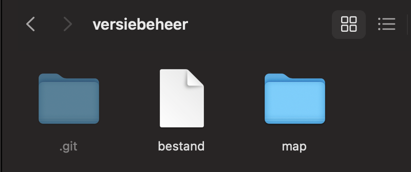

# Versie beheer
Zodra je een tijd bezig bent met programmeren, kan het zijn dat je iets meer wensen hebt voor het opslaan van je code.

Misschien heb je eindelijk je code werkend, maar wil je iets anders proberen? Als je nieuwe poging niet handig blijkt, zal het heel moeilijk worden om terug te gaan naar je oude werkende versie.

Misschien wil je op je laptop werken, maar ook thuis op je desktop.

Misschien wil je samenwerken met andere mensen. Hoe krijg je jouw code op hun laptop, en andersom?

Daar hebben we versie beheer voor. Daarmee kan je:

- Meerdere veranderingen in bestanden allemaal in 1x opslaan met een omschrijving
- Terug naar de vorige versie van elk bestand die je zelf kiest
- Met meerdere computers/mensen werken aan hetzelfde project
- Het hele project zorgeloos stuk maken, zonder gevolgen


# Git
Om dat allemaal voor je te regelen, heb je software nodig. Git is de populairste applicatie voor versie beheer. Je installeert het op je laptop (of via je code editor) en je kan het meteen gebruiken. Git kan alles wat hierboven vermeld is, en nog veel (veel) meer.

Er komen wel wat nieuwe concepten bij kijken

## Repository
Een repository is een opslagplaats. In een repository stop je doorgaans één project - denk b.v. aan alle Java opdrachten, of een repository voor al je HTML opdrachten.

De repository maak je aan in een map (directory), en alles wat daarin staat (ook alle andere mappen!) horen bij het domein van Git.

## Branch
In een repository wordt alle code opgeslagen in een `branch`. Vrij vertaald is het een `tak`, en dat is verrassend accuraat. Standaard werk je in de main branch (een `branch` genaamd `main`). Daarin wordt al je code opgeslagen. Waarom in een branch? Om makkelijk te kunnen samen werken.

Als je met iemand gaat samenwerken op 1 project, dan werk je allebei in een __kopie__ van de code. Oftewel je eigen branch; een aftakking van de main branch. Als je klaar bent, en het werkt, ga je jouw aanpassingen weer samenvoegen in de main branch.

Zodra je allebei dezelfde code aanpast kan er wel een probleem ontstaan. Degene die het laatste zijn aanpassingen in de main branch wilt samen voegen, krijgt een __conflict__. Want zijn aanpassingen zijn op een oudere versie van de code en Git weet niet meer hoe deze samengevoegd moeten worden. Dat moet je dan zelf doen. Dat is een __merge conflict__.

## Commit
In een branch sla je dus alle code op. Zodra je iets werkend hebt op je laptop, waar je blij mee bent, kan je je wijzigingen in 1x opslaan in Git. Alle wijzigingen in welk bestand dan ook, zolang ze in dezelfde git map staan. Dat doe je met een `commit`. 

Een commit is dus alle wijzigingen vanaf de vorige opgeslagen versie van de code. Daarbij kan je een naam en een omschrijving toevoegen. Zo kan je makkelijk de vorige versies van code terug vinden.

Al je code tot nu toe is dus niets meer dan een lijst van commits; een serie van wijzigingen op wijzigingen op wijzigingen. Zo kan je heel flexibel terug springen naar de vorige versie van je code, in welk bestand dan ook, en raak je nooit meer iets kwijt.

\pagebreak

# GitHub
GitHub is het social media platform voor programmeurs. Je hebt een profiel, kan andere programmeurs volgen, je hebt een timeline, etc.

Maar GitHub gaat ook om _samenwerken_. Je mag daar gratis je Git repositories opslaan. Die kan je publiek toegankelijk maken, en dan staan ze op je profiel, maar dat kan ook privé en dan zie je ze alleen zelf.

Je kan je Git repository van je laptop naar GitHub wilt sturen, en ook de laatste wijzigingen van GitHub ophalen richting je laptop. Zo kan je dus heel makkelijk samenwerken met anderen: Je hebt allebei dezelfde repository op je laptop, maar je stuurt je wijzigingen naar GitHub en haalt ze daar ook weer op.

## Pull request (of merge request)
Het is niet altijd even handig om iedereen in je project zomaar alle code aan te laten passen. Voordat iemands code dus in de main branch wordt samengevoegd, kan je dat laten controleren door andere projectleden; dat noem je een pull request of merge request.

Je maakt een pull request aan op GitHub, om een branch te laten samenvoegen naar een andere branch (de `main`, doorgaans). Alle teamleden kunnen de code controleren, en goedkeuren of comments plaatsen. Daarna kan je met een druk op de knop de code samenvoegen (of _mergen_).

\pagebreak

# Opdrachten Git
Je gaat een Git repository maken, en vullen met wat bestanden en mappen. Dan gaan we kijken hoe Git je kan helpen met het opslaan van je code.


## Opdracht 1: Maak een repository
Maak van een bestaande map een Git repository. Dat noem je initialiseren. Maak een nieuw project in je code editor (het maakt niet uit wat voor project).

Open de terminal (alt+F12 / option+F12) en typ in:

```{.bash .number-lines}
git init
```

Nu heb je een Git repository gemaakt. De standaard branch `main` staat er al. Alles in deze map (alle bestanden én mappen) vallen nu onder de repository.

Maar hoe werkt dat? Git heeft zijn eigen informatie, zoals welke branches er zijn, op welke branch zit je nu, en wat zijn alle opgeslagen veranderingen tot nu toe. Dat moet ergens opgeslagen worden, en dat doet het in een `.git` map. De punt (.) voor de naam zorgt ervoor dat het doorgaans verborgen is.

Dat ziet er zo uit:

{ width=50% }

- main branch
- Maak een bestand met tekst erin, maak commit
- Maak een nieuwe branch, kijk naar branch lijst, switch heen en terug
- Maak wijziging in nieuwe branch en merge terug

## Opdracht 2: Maak een commit
Maak een bestand aan (in de repository), en zet daar wat code of tekst in. Dat kan van alles zijn, voor het voorbeeld hou ik `test-bestand.php` aan. Nu kan je de status van de repository bekijken met:

```{.bash .number-lines}
git status
```

Als je dat in de terminal typt ziet het resultaat er ongeveer zo uit:

```{.bash .number-lines}
On branch main

Untracked files:
  (use "git add <file>..." to include in what will be committed)
        test-bestand.php
```

Zoals je ziet is het bestand `untracked`, oftewel het is nog niet aan Git toegevoegd. Git weet nog niet dat het bestand bestaat, dat kan je veranderen met:

```{.bash .number-lines}
git add test-bestand.php
```

Als je nu `git status` doet, zie je heel wat anders:
```{.bash .number-lines}
On branch main

No commits yet

Changes to be committed:
  (use "git rm --cached <file>..." to unstage)
	new file:   test-bestand.php
```

Git ziet een nieuw bestand genaamd `test-bestand.php`, klaar om ge-commit te worden. Een `commit` is 1 of meer veranderingen in je code die je in Git wilt opslaan. Dat kan één bestand zijn of veertig, dat maakt niet uit. De commit kan je een naam geven om makkelijk de geschiedenis van je code terug te kunnen zien.

Maak een commit en zet er een mooie naam bij:

```{.bash .number-lines}
git commit -m "Dit is een mooi bericht voor bij mijn commit"
```

Het bestand is nu ge-commit. Wat je ook doet het het bestand, verwijderen of aanpassen, je kan altijd teruggaan naar het bestand zoals het er nu staat. Als je nu `git status` doet zal het zeggen dat er niets te doen is.

## Opdracht 3: Maak nóg een commit
Verander de tekst in het bestand dat je hebt aangemaakt. Voeg de veranderingen toe en maak een nieuwe commit:

```{.bash .number-lines}
git add test-bestand.php
git commit -m "nu is het bestand NOG mooier"
```

## Opdracht 4: Bekijk de commits

Je kan alle commits in een repository terugzien door dit in je terminal te typen:

```{.bash .number-lines}
git log
```

Dan ziet het er ongeveer zo uit:

```{.bash .number-lines}
commit 575b6f762bb6b108dee6b1569297098460f4662b (HEAD -> main)
Author: Tim Quax <t.quax@novacollege.nl>
Date:   Thu Sep 15 17:55:33 2022 +0200

    nu is het bestand NOG mooier

commit 1479d14e28ea6b67585a7319b87e5026ec7ab3f3
Author: Tim Quax <t.quax@novacollege.nl>
Date:   Thu Sep 15 17:50:47 2022 +0200

    Dit is een mooi bericht voor bij mijn commit
```

Het meeste spreekt voor zich, de auteur en datum en het bericht die we bij de commit hebben gezet. Maar er staat ook een lang brok tekst bij `commit`. Dat is de `commit ID`, en die zal je nodig hebben als je terug moet zoeken in de geschiedenis van je code.

## Opdracht 5: Ga terug naar de oude versie
Laten we tijdelijk even teruggaan in de tijd, om te kijken naar de vorige versie van het bestand. Dat doen we door een specifieke commit uit te checken. Pak daarvoor de `commit ID` van de onderste commit in de lijst hierboven (van `git log`).

Als voorbeeld heb ik hieronder de `commit ID` van mijn eigen Git repository:

```{.bash .number-lines}
git checkout 1479d14e28ea6b67585a7319b87e5026ec7ab3f3
```


# Opdrachten GitHub

- Maak een account op GitHub
- Maak een repository
- Koppel de repository op je laptop met die van GitHub
